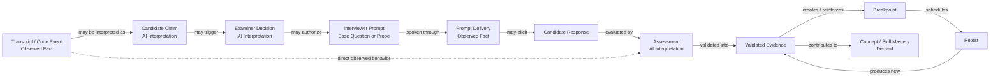

# CounterQ — Phase 1 Domain & Persistence Model

**Document:** `docs/data/DATA_MODEL.md`  
**Status:** Frozen Phase 1 Data Architecture Source of Truth  
**Product:** CounterQ  
**Phase:** Phase 1 — Minimum Lovable Product  
**Last Updated:** August 2026

---

# 1. Purpose

This document defines the production-oriented domain and persistence model for CounterQ Phase 1.

It builds on:

- `docs/PRODUCT.md`
- `docs/PHASE_1.md`
- `docs/ARCHITECTURE.md`

The purpose of this model is not merely to store interview results.

CounterQ must be capable of reconstructing:

> **what happened, what CounterQ believed happened, what CounterQ ultimately accepted as evidence, and how that evidence influenced later conclusions.**

The model must preserve enough provenance to answer:

- What exactly did the candidate say?
- What code existed at that moment?
- What claim did CounterQ extract?
- Which model extracted it?
- Why did CounterQ consider asking or probing it?
- Which interviewer prompt kind was selected?
- If it was an adaptive probe, which ProbeStrategy was selected?
- Was the interviewer prompt actually delivered?
- Was it interrupted?
- What did the candidate respond?
- Had the candidate already changed their code?
- Which assessment was produced?
- Which assessment was accepted as evidence?
- Which concept or interview skill did it affect?
- Did the evidence create or reinforce a breakpoint?
- Did mastery change?
- Which evidence caused that mastery change?
- Was the weakness deliberately tested again later?

This document intentionally favors:

- explicit provenance;
- append-oriented history;
- normal relational modelling;
- rebuildable projections;
- explainability;

over clever but opaque persistence.

---

# 2. Architecture clarifications incorporated

Before freezing `ARCHITECTURE.md`, CounterQ Phase 1 adopts three additional architecture rules.

## 2.1 Live Examiner path is not a generic worker queue

Candidate-visible Examiner reasoning must not depend on a normal Redis background-job queue.

Latency-sensitive analysis uses a dedicated asynchronous live path:

```text
Durable event committed
        ↓
Live Examiner Coordinator
        ↓
async reasoning task
        ↓
deadline / cancellation token
        ↓
ExaminerDecision
        ↓
staleness + policy gate
        ↓
candidate-visible probe if still useful
```

The live path supports:

- deadlines;
- cancellation;
- source-event watermarks;
- state-version validation;
- code-version validation;
- task cancellation when superseded;
- immediate result delivery.

Redis worker queues remain appropriate for:

- report generation;
- CounterMap materialization;
- mastery aggregation;
- mastery recalculation;
- retest generation;
- Interview Pack generation;
- non-live evidence enrichment;
- other eventual work.

A candidate-visible probe must never wait behind a backlog of report-generation jobs.

---

## 2.2 Transactional outbox

Durable downstream jobs use a PostgreSQL transactional outbox.

Whenever a transaction creates durable state requiring eventual processing, it may atomically insert:

- the domain row(s);
- the corresponding `outbox_event`.

Only after commit may an outbox dispatcher publish work to Redis.

This prevents:

```text
database commit succeeds
        ↓
process crashes before queue publish
        ↓
downstream work silently disappears
```

The database commit and the intention to perform downstream work therefore share the same transaction.

The outbox is deliberately lightweight.

CounterQ does not require Kafka for Phase 1.

---

## 2.3 Four-level information hierarchy

CounterQ explicitly distinguishes:

### Level A — Observed Events

Facts about what occurred.

### Level B — AI Interpretations

Model-generated hypotheses or judgments.

### Level C — Validated Evidence

Structured conclusions CounterQ accepts for downstream use.

### Level D — Derived Projections

Rebuildable presentations and aggregates.

This distinction is foundational to the entire data model.

---

# 3. Core causal model

CounterQ must preserve the causal chain for both ordinary interviewer questions and adaptive probes:

```text
Candidate Activity
        ↓
Observed Event
        ↓
Candidate Claim / Interpretation        [optional]
        ↓
Examiner Decision                       [optional]
        ↓
Interviewer Prompt Intent
        ↓
Prompt Delivery
        ↓
Candidate Response                      [optional grouping]
        ↓
Assessment
        ↓
Validated Evidence
        ↓
Breakpoint                              [when warranted]
        ↓
Concept / Skill Mastery
        ↓
Retest Recommendation
        ↓
Retest Attempt
```

`InterviewerPrompt` is the general candidate-visible interaction model. It covers ordinary interview questions as well as adaptive probes.

Examples include:

- `BASE_QUESTION`
- `CLARIFICATION`
- `PROBE`
- `TRANSITION`
- `INSTRUCTION`
- `TIME_WARNING`

Only prompts with `kind = PROBE` require a `ProbeStrategy`.

Not every interview follows every step.

For example, CounterQ must support evidence paths such as:

```text
Code change
   ↓
Assessment
   ↓
Evidence
```

and:

```text
Candidate independently fixes suspicious code
   ↓
Assessment
   ↓
Positive Evidence
```

without requiring a prior prompt, spoken claim, or CandidateResponse grouping.

The model must therefore support both rich conversational causal chains and direct observation-to-evidence paths.

---

# 4. Source-of-truth hierarchy

CounterQ has four data layers.

They are not interchangeable.

---

# 5. Level A — Observed Events

Observed events represent what CounterQ directly knows happened.

Examples:

- candidate transcript segment finalized;
- CounterQ utterance delivered;
- code snapshot created;
- meaningful code diff created;
- Run clicked;
- compiler returned an error;
- test failed;
- candidate declared done;
- interview stage transitioned;
- candidate interrupted CounterQ;
- voice connection disconnected.

Observed events should be:

- immutable where practical;
- append-oriented;
- timestamped;
- ordered within an interview;
- attributable to a source;
- schema-versioned.

Observed events are the lowest durable factual layer.

They must not contain statements such as:

> "Candidate does not understand amortized complexity."

That is an interpretation.

---

# 6. Level B — AI Interpretations

AI interpretations contain model-generated hypotheses.

Examples:

- candidate appears to have claimed O(1) worst-case lookup;
- statement relates to hash-table complexity;
- code may violate a sliding-window invariant;
- candidate appears uncertain;
- candidate's complexity explanation may be incorrect;
- CounterQ should consider an `ASSUMPTION_CHALLENGE`.

Interpretations may be:

- accepted;
- rejected;
- superseded;
- stale;
- unresolved.

They are never automatically treated as facts.

Entities in this layer include:

- `candidate_claims`;
- `examiner_decisions`;
- `assessments`.

---

# 7. Level C — Validated Evidence

Evidence represents a conclusion CounterQ permits downstream systems to use.

Examples:

> Candidate failed to justify why a sliding-window pointer remains monotonic.

or:

> Candidate independently corrected an off-by-one error before receiving assistance.

Evidence must have:

- explicit provenance;
- source events;
- relevant concept(s);
- relevant skill dimension(s);
- polarity;
- strength;
- confidence;
- validation status;
- policy version.

Evidence can support:

- reports;
- breakpoints;
- mastery;
- retesting.

Evidence is the highest canonical evaluation layer.

---

# 8. Level D — Derived Projections

Derived data can be rebuilt from canonical lower-level data.

Examples:

- CounterMap;
- Session Report;
- score summaries;
- current Concept Mastery;
- current Skill Mastery;
- Mastery Map;
- progress analytics;
- retest ranking.

Projections may be persisted for:

- performance;
- stable user presentation;
- versioned report history.

They remain rebuildable.

If projection data disagrees with canonical evidence, canonical evidence wins.

---

# 9. Canonical vs derived rule

The hierarchy is:

```text
Observed facts
    ↓
AI interpretations
    ↓
Validated evidence
    ↓
Derived projections
```

Never reverse it.

For example:

A report saying:

> "Hash-table complexity is weak"

cannot itself become evidence that hash-table complexity is weak.

Likewise, a `WEAK` mastery state cannot be used to fabricate source evidence.

---

# 10. Persistence philosophy

CounterQ is **not** implemented as a pure event-sourced system.

`interview_events` provides:

- auditability;
- ordering;
- reconnect support;
- provenance anchors;
- causal references.

Important domain entities still have normal typed relational tables.

Examples:

- transcript segments;
- code snapshots;
- claims;
- probes;
- evidence;
- mastery.

This gives CounterQ an inspectable history without requiring every application query to rebuild state by replaying an event stream.

---

# 11. Identifier strategy

Phase 1 should use application-generated UUIDv7 identifiers where practical.

Advantages:

- globally unique;
- sortable approximately by creation time;
- safer than exposing sequential integer IDs;
- easy to create before database insertion;
- useful across async boundaries.

Normal PostgreSQL primary keys should use:

```text
UUID
```

rather than separate public/private IDs.

Human-readable problem slugs may exist separately.

---

# 12. Time modelling

All durable timestamps use:

```text
TIMESTAMPTZ
```

and are stored in UTC.

Important events distinguish:

- `occurred_at`
- `received_at`

because a client event may occur before CounterQ receives it.

Provider audio/transcript timestamps may additionally use session-relative milliseconds.

Do not store local wall-clock timestamps without timezone.

---

# 13. Versioning principles

CounterQ must version:

- event schemas;
- Problem content;
- Interview Packs;
- code snapshots;
- interview state;
- AI policies;
- report schemas;
- projection schemas;
- mastery policies.

Versioning enables future answers to questions such as:

> "Which policy generated this evidence?"

and:

> "Can we rebuild this report under the current report policy?"

---

# 14. Identity domain

## 14.1 User

`User` represents the authenticated CounterQ account.

Canonical fields include:

- `id`
- external authentication subject/provider linkage
- account status
- created timestamp
- deletion state

Authentication credentials themselves should generally remain with the chosen authentication provider.

CounterQ should not build its own password-storage system unless required.

---

## 14.2 CandidateProfile

Stores candidate-specific interview preferences.

Fields may include:

- `user_id`
- display name
- preferred language
- default interview mode
- interview level
- target role
- timezone
- profile version

Phase 1 does **not** require a separate `CandidateGoal` table.

The Phase 1 target is narrow enough that fields such as:

- target role;
- interview level;

can live directly on `candidate_profiles`.

A separate goal-history domain should only be introduced when users can maintain multiple active goals.

---

# 15. Interview configuration domain

---

# 16. InterviewSession

`InterviewSession` is the root aggregate for one interview.

It owns the authoritative session lifecycle.

Key concepts:

- candidate;
- selected ProblemVersion;
- selected InterviewPackVersion;
- immutable configuration;
- current stage;
- state version;
- started/ended timestamps;
- completion state;
- active connection state;
- mode;
- session deadline.

Important fields include conceptually:

```text
id
user_id
interview_configuration_id
problem_version_id
interview_pack_version_id
current_stage
state_version
status
started_at
deadline_at
completed_at
last_server_sequence
created_at
```

`current_stage` is a convenient current-state projection.

The historical truth comes from stage-transition events.

---

# 17. InterviewConfiguration

Configuration should be immutable once an interview starts.

Contains:

- interview mode;
- interview level;
- coding language;
- configured duration;
- problem source;
- optional custom-problem preparation reference.

Why a separate table rather than embedding directly in `interview_sessions`?

Because configuration is:

- immutable;
- useful for provenance;
- logically separate from mutable lifecycle state.

A 1:1 relationship is acceptable.

---

# 18. InterviewMode

Phase 1 values:

- `COACH`
- `SIMULATION`

This does not need a lookup table.

Use application enums with database `CHECK` constraints.

---

# 19. InterviewLevel

Phase 1 values:

- `INTERN`
- `NEW_GRAD`
- `EARLY_CAREER`

Again, no separate lookup table is needed.

---

# 20. SessionBudget

A 1:1 `session_budgets` row belongs to every interview.

Configured limits include:

- max duration;
- max probes;
- max deep reasoning calls;
- max strong reasoning calls;
- max vision calls;
- soft monetary budget;
- hard monetary budget;
- realtime-reserved budget.

It may also maintain authoritative consumed counters.

Examples:

```text
probes_used
deep_reasoning_used
strong_reasoning_used
vision_used
estimated_cost
```

The full cost ledger still comes from `ai_invocations`.

Budget counters are operational state, not the financial source of truth.

---

# 21. Interview stage

`InterviewStage` is a software enum, not a table.

The authoritative history belongs in:

`interview_stage_transitions`

Each transition records:

- interview;
- previous stage;
- next stage;
- state version;
- trigger;
- occurred timestamp;
- corresponding InterviewEvent;
- transition policy version.

This makes the lifecycle reconstructable.

---

# 22. Problem domain

---

# 23. Problem

`problems` represents the stable identity of a coding problem.

Examples:

```text
two-sum
minimum-window-substring
custom:<uuid>
```

A Problem is not the actual immutable prompt content.

That belongs to ProblemVersion.

Fields:

- ID;
- source type;
- canonical slug if curated;
- ownership for custom problems;
- lifecycle status.

---

# 24. ProblemVersion

Every interview references an immutable ProblemVersion.

It contains:

- title;
- statement;
- constraints;
- examples;
- structured input/output information where available;
- normalized problem hash;
- schema version;
- created timestamp.

If a curated problem is edited, create a new ProblemVersion.

Do not mutate the problem text underlying completed interviews.

---

# 25. Interview Pack

CounterQ does **not** need separate mutable `interview_packs` and `interview_pack_versions` tables in Phase 1.

That would add an unnecessary header/version abstraction.

Instead:

> Each `interview_pack_versions` row is itself an immutable pack version.

It references:

- ProblemVersion;
- pack schema version;
- preparation policy;
- generation AI invocation where applicable;
- review status.

The structured pack may use JSONB for flexible technical content such as:

- expected approaches;
- common misconceptions;
- invariants;
- edge cases;
- mutations.

Important cross-domain relationships such as ProblemConcept remain relational.

---

# 26. ProblemConcept

`problem_concepts` links a ProblemVersion to canonical Concepts.

Fields may include:

- `problem_version_id`
- `concept_id`
- relevance;
- expected importance;
- role such as:
  - PRIMARY
  - SECONDARY
  - OPTIONAL

This supports efficient retrieval of candidate mastery relevant to a problem.

---

# 27. Observed event system

The event timeline is centered on:

`interview_events`

---

# 28. InterviewEvent

An InterviewEvent is an append-oriented factual record.

Conceptual fields:

```text
id
interview_session_id
user_id
event_type
source
occurred_at
received_at
client_instance_id
client_sequence
server_sequence
interview_state_version
causation_id
correlation_id
code_snapshot_id
idempotency_key
payload
provenance
schema_version
created_at
```

---

# 29. Event source

Typical sources include:

- `CANDIDATE_VOICE`
- `COUNTERQ_VOICE`
- `NATIVE_EDITOR`
- `NATIVE_RUNNER`
- `BROWSER_EXTENSION`
- `INTERVIEW_ORCHESTRATOR`
- `SYSTEM`

Use constrained text values.

Do not create a lookup table.

---

# 30. Event types

Examples include:

- `TRANSCRIPT_FINALIZED`
- `COUNTERQ_UTTERANCE_DELIVERED`
- `CODE_SNAPSHOT_CREATED`
- `MEANINGFUL_CODE_CHANGE`
- `RUN_CLICKED`
- `COMPILE_COMPLETED`
- `TEST_COMPLETED`
- `STAGE_CHANGED`
- `CANDIDATE_DECLARED_DONE`
- `CANDIDATE_INTERRUPTED_COUNTERQ`
- `COUNTERQ_INTERRUPTED_CANDIDATE`
- `REALTIME_DISCONNECTED`
- `REALTIME_RECONNECTED`

The event-type vocabulary will evolve.

Use constrained application values rather than native PostgreSQL ENUMs that become awkward to modify repeatedly.

---

# 31. Ordering guarantees

CounterQ cannot guarantee perfect global ordering based purely on client timestamps.

It therefore uses:

## Client ordering

```text
client_instance_id + client_sequence
```

This provides ordering for events emitted by one connected browser instance.

## Server ordering

Each accepted event receives a monotonically increasing:

```text
server_sequence
```

within its InterviewSession.

Unique constraint:

```text
(interview_session_id, server_sequence)
```

The server sequence is authoritative for accepted event order.

`occurred_at` remains useful for approximate real-world timing.

---

# 32. Assigning server sequence

Sequence allocation should occur atomically with event persistence.

An implementation may increment:

```text
interview_sessions.last_server_sequence
```

within the same transaction.

Phase 1 interview event volumes are sufficiently small that this is preferable to complicated distributed sequence infrastructure.

---

# 33. Duplicate handling

Every client-originated event should include an idempotency identifier.

Recommended uniqueness:

```text
(interview_session_id, idempotency_key)
```

Duplicate retransmission returns the already-accepted event rather than inserting another event.

This is important during reconnect.

---

# 34. Reconnect behavior

After reconnect:

1. client sends its latest acknowledged `server_sequence`;
2. server returns any newer relevant events;
3. client retransmits unacknowledged events;
4. duplicate idempotency keys are ignored;
5. current code is reconciled against the latest snapshot hash.

For editor state, snapshot reconciliation is preferred over replaying hundreds of raw client mutations.

---

# 35. Event causation and correlation

`causation_id` answers:

> Which prior event directly caused this event?

Example:

```text
RUN_CLICKED
    ↓ causes
TEST_COMPLETED
```

`correlation_id` groups related events across a workflow.

Example:

```text
candidate turn
claim extraction
examiner decision
interviewer prompt delivery
response assessment
```

may share one correlation identifier.

These are debugging/provenance mechanisms rather than domain foreign keys.

---

# 36. Typed columns vs JSONB

Important fields used for:

- joins;
- ordering;
- ownership;
- access control;
- indexing;
- causal reconstruction;

belong in typed columns.

Examples:

- interview ID;
- event type;
- source;
- timestamps;
- sequence;
- state version;
- code snapshot.

Variable event-specific information belongs in `payload JSONB`.

Example:

For `REALTIME_DISCONNECTED`:

```json
{
  "provider_reason": "...",
  "connection_duration_ms": 53120
}
```

Do not place essential relationships such as `interview_session_id` inside JSONB.

---

# 37. Provenance JSON

`provenance JSONB` may contain low-level source metadata such as:

- frontend version;
- browser connection ID;
- realtime provider event ID;
- extension adapter version;
- original external event ID.

It should not duplicate all typed fields.

---

# 38. Does every entity require an InterviewEvent?

No.

That would be event sourcing for its own sake.

Entities representing actual interview occurrences generally should have a corresponding event.

Examples:

- transcript finalization;
- interviewer prompt delivery;
- run;
- code change;
- stage transition.

Interpretive entities do not need fake observed events.

Examples:

- CandidateClaim;
- Assessment;
- Evidence;
- Mastery transition.

Those entities carry their own provenance.

---

# 39. Transcript modelling

---

# 40. TranscriptSegment

Only finalized transcript segments are durable by default.

Fields include:

```text
id
interview_session_id
interview_event_id
speaker
sequence
started_at
ended_at
text
provider_confidence
interview_stage
interview_state_version
delivery_state
interrupted_at
provider_segment_id
created_at
```

Speaker values:

- `CANDIDATE`
- `COUNTERQ`

---

# 41. Partial transcripts

Partial transcripts should generally remain:

- browser memory;
- realtime-provider state;
- Redis short-lived state.

They may be used for think-ahead analysis.

They do not automatically become:

- durable transcript;
- claims;
- evidence.

Only finalized segments enter the normal durable transcript path.

---

# 42. Interrupted CounterQ utterance

Suppose CounterQ intends to say:

> "You said always. Is that actually guaranteed?"

but the candidate interrupts after:

> "You said always..."

The durable TranscriptSegment stores only the actually delivered speech where the provider exposes that information.

It also records:

```text
delivery_state = INTERRUPTED
```

and:

```text
interrupted_at
```

The full intended wording remains associated with the InterviewerPrompt.

The InterviewerPromptDelivery stores both:

- intended utterance;
- actual delivered transcript reference.

This distinction is essential.

CounterQ must not assess the candidate as though they heard a question that was never fully delivered.

---

# 43. Code versioning

CounterQ does not store every keystroke.

The durable code timeline consists of meaningful snapshots and diffs.

---

# 44. CodeSnapshot

A CodeSnapshot represents the complete source at a meaningful point.

Fields include:

```text
id
interview_session_id
version_number
parent_snapshot_id
language
source_code
content_hash
created_from_event_id
created_at
```

Unique:

```text
(interview_session_id, version_number)
```

`content_hash` uses a stable cryptographic hash over normalized source bytes.

---

# 45. When snapshots are created

Examples:

- interview implementation begins;
- meaningful structural change;
- candidate speaks specifically about current code;
- Run clicked;
- candidate declares done;
- Examiner requires stable code context;
- session checkpoint/reconnect.

Do not snapshot on every character.

---

# 46. CodeDiff

`code_diffs` stores meaningful changes between snapshots.

Fields include:

```text
id
interview_session_id
from_snapshot_id
to_snapshot_id
diff_format
diff_content
change_summary
significance
created_from_event_id
created_at
```

`diff_content` may contain unified diff text or another stable representation.

`change_summary` is optional interpretation metadata and must not replace the actual diff.

---

# 47. Snapshot-parent relationship

Snapshots form a simple version chain:

```text
snapshot 12
   ↓
snapshot 13
   ↓
snapshot 14
```

Phase 1 does not need Git-style branching.

If reconnect creates conflicting local state, CounterQ resolves to a new authoritative snapshot rather than maintaining a code-version DAG.

---

# 48. Examiner code provenance

Every ExaminerDecision based on code must reference:

- `source_code_snapshot_id`;
- optionally relevant `code_diff_id`;
- `source_event_watermark`;
- `interview_state_version`.

This enables stale-probe detection.

Example:

```text
Decision created from code v12
Candidate updates to v14
Decision requires invariant still present
Policy gate compares latest state
Decision becomes STALE
```

---

# 49. ExecutionRun

Each candidate run is represented by:

`execution_runs`

Fields:

- interview;
- run event;
- code snapshot;
- language/runtime version;
- status;
- started/finished timestamps;
- stdout;
- stderr;
- compiler output;
- exit code;
- timeout state;
- sandbox request ID.

The run must always reference the exact CodeSnapshot executed.

---

# 50. TestResult

`test_results` represents individual or grouped test results associated with an ExecutionRun.

Fields include:

- execution run;
- test identifier;
- visible/hidden flag where applicable;
- input reference;
- expected result;
- actual result;
- status;
- duration;
- failure classification.

Phase 1 should avoid storing unnecessary enormous outputs.

Apply size limits.

---

# 51. Pauses and interruptions

Phase 1 does not need a separate `pauses` table.

Pause and interruption facts should normally remain InterviewEvents because:

- they are temporal occurrences;
- they rarely require independent relational querying.

Prompt-specific interruption information additionally belongs on InterviewerPromptDelivery.

Do not create tables merely because an event has a name.

---

# 52. CandidateClaim

A CandidateClaim is an AI interpretation.

It is not a direct observed fact, and it does not have to originate from speech.

A claim may originate from:

- finalized candidate transcript;
- code snapshot;
- meaningful code diff;
- execution/test event;
- combined speech + code context.

Example from speech:

Candidate transcript:

> "I'll use unordered_map because lookup is always O(1)."

The CandidateClaim may normalize this to:

> `unordered_map lookup has guaranteed O(1) time complexity`

Example from code only:

```text
Candidate says nothing.
Code changes from v17 to v18 and removes a monotonic-bound guard.
```

CounterQ may create an interpretation such as:

> `current implementation may violate the sliding-window left-pointer invariant`

Fields include:

```text
id
interview_session_id
origin_kind
source_transcript_segment_id       nullable
source_event_id                    nullable
source_code_snapshot_id            nullable
source_code_diff_id                nullable
verbatim_excerpt                   nullable
normalized_claim
claim_type
extraction_confidence
status
ai_invocation_id
ai_policy_version_id
created_at
```

At least one factual source reference must exist.

`origin_kind` may use values such as:

- `TRANSCRIPT`
- `CODE`
- `EXECUTION`
- `MULTIMODAL_CONTEXT`

A transcript reference must therefore never be required merely because the entity is called CandidateClaim.

---

# 53. Claim types

Possible initial types include:

- `ALGORITHM_CHOICE`
- `COMPLEXITY`
- `CORRECTNESS`
- `INVARIANT`
- `DATA_STRUCTURE`
- `ASSUMPTION`
- `EDGE_CASE`
- `IMPLEMENTATION`
- `TRADE_OFF`

Do not create a database table for these in Phase 1.

Use constrained application values.

---

# 54. Claim status

Examples:

- `PROPOSED`
- `ACCEPTED_AS_INTERPRETATION`
- `REJECTED`
- `SUPERSEDED`

"Accepted" means:

> CounterQ accepts that this is a reasonable interpretation of what the candidate meant.

It does **not** mean the technical claim is correct.

---

# 55. Claim concepts

A claim may relate to multiple canonical concepts.

Use:

`candidate_claim_concepts`

with:

- claim ID;
- concept ID;
- relevance/confidence.

Do not store a free-form array of concept names as the only representation.

---

# 56. Claim provenance

Every claim must be traceable to:

- candidate source statement;
- optional code snapshot;
- AI invocation;
- AI policy version.

If an AI later extracts a better interpretation, create a new claim or supersede the old one.

Do not silently mutate the original interpretation.

---

# 57. ExaminerDecision

`examiner_decisions` records what CounterQ considered doing.

This is one of the most important provenance entities.

Fields include:

```text
id
interview_session_id
action
target_claim_id
target_event_id
target_code_snapshot_id
proposed_probe_strategy
technical_rationale
confidence
priority
urgency
source_event_watermark
source_state_version
created_at
deadline_at
expiry_policy
policy_gate_outcome
policy_gate_reason
status
ai_invocation_id
ai_policy_version_id
```

---

# 58. Examiner actions

Values:

- `WAIT`
- `OBSERVE`
- `ASK`
- `PROBE`

`WAIT` and `OBSERVE` decisions may be sampled or persisted selectively.

CounterQ does **not** need to persist a row every second saying:

```text
WAIT
```

Persist decisions when they are produced by meaningful reasoning or are relevant for understanding why an intervention was or was not made.

---

# 59. Decision watermark

`source_event_watermark` stores the latest server sequence included in the reasoning context.

For example:

```text
source_event_watermark = 142
```

means:

> This decision reasoned over authoritative interview events through sequence 142.

This is more reliable than vague timestamps for staleness checking.

---

# 60. Decision deadline

Candidate-visible decisions have a usefulness deadline.

Example:

```text
deadline_at = current_time + short policy-defined window
```

If deep analysis finishes after the deadline:

- result may still inform evidence;
- it must not automatically become a spoken probe.

---

# 61. Policy gate

The policy gate outcome is stored separately from the model proposal.

Possible outcomes:

- `AUTHORIZED`
- `REJECTED`
- `STALE`
- `BUDGET_DENIED`
- `STAGE_INVALID`
- `LOW_CONFIDENCE`
- `SUPERSEDED`
- `EXPIRED`

This answers:

> The model suggested a probe. Why didn't the candidate hear it?

---

# 62. Low-latency Examiner execution

The live Examiner task itself is not represented as a generic background-job table.

Its lifecycle is primarily operational.

The durable records are:

- triggering InterviewEvent;
- AIInvocation;
- resulting ExaminerDecision.

Live execution uses:

- async task;
- deadline;
- cancellation token;
- event watermark;
- latest-state reconciliation.

If a process crashes before producing an ExaminerDecision, no fake decision is persisted.

The triggering event remains durable.

Optional later analysis may occur through outbox-driven non-live processing.

---

# 63. Interviewer prompt lifecycle

CounterQ separates:

> **interviewer intent**

from:

> **what was actually delivered to the candidate**

because not every intended question is spoken, and not every spoken question is an adaptive probe.

The general interaction chain is:

```text
InterviewerPrompt
        ↓
InterviewerPromptDelivery
        ↓
CandidateResponse
```

---

# 64. InterviewerPrompt

`interviewer_prompts` represents a meaningful candidate-visible interviewer action.

It replaces a probe-only persistence model so CounterQ can reconstruct ordinary interview questions and adaptive follow-ups using one consistent structure.

Fields include:

```text
id
interview_session_id
examiner_decision_id              nullable
origin
kind
probe_strategy                    nullable
source_stage_transition_id        nullable
target_claim_id                   nullable
target_concept_id                 nullable
target_skill_dimension_id         nullable
intent
status
authorized_at                     nullable
created_at
```

`origin` identifies how the prompt was created, for example:

- `STATE_MACHINE`
- `EXAMINER_DECISION`
- `SYSTEM`

`kind` initial values:

- `BASE_QUESTION`
- `CLARIFICATION`
- `PROBE`
- `TRANSITION`
- `INSTRUCTION`
- `TIME_WARNING`

Examples:

`BASE_QUESTION`:

> Explain the problem in your own words.

`CLARIFICATION`:

> What assumption are you making about the input?

`PROBE`:

> Test whether the candidate understands that unordered_map complexity is not a worst-case constant guarantee.

`TIME_WARNING`:

> We're almost out of time. Give me the complexity and key invariant.

The `intent` field stores the semantic objective, not necessarily the exact spoken wording.

---

# 65. Probe strategy

`probe_strategy` is required only when:

```text
kind = PROBE
```

Initial values include:

- `WHY`
- `PROVE`
- `ASSUMPTION_CHALLENGE`
- `COUNTEREXAMPLE`
- `COMPLEXITY`
- `EDGE_CASE`
- `TRADE_OFF`
- `ALTERNATIVE`
- `IMPLEMENTATION_CHOICE`
- `CONSTRAINT_MUTATION`
- `FAILURE_MODE`
- `TRANSFER`

No lookup table is required in Phase 1.

For non-probe prompts, `probe_strategy` must be null.

---

# 66. InterviewerPrompt states

An InterviewerPrompt may progress through:

```text
PROPOSED
    ↓
AUTHORIZED
    ↓
DELIVERED
    ↓
ANSWERED
```

Alternative terminal states include:

- `REJECTED`
- `STALE`
- `EXPIRED`
- `INTERRUPTED`
- `CANCELLED`

Not every state applies to every prompt kind.

For example, deterministic `TIME_WARNING` prompts may be created directly as authorized state-machine prompts.

Actual delivery details live in `InterviewerPromptDelivery`.

---

# 67. InterviewerPromptDelivery

`interviewer_prompt_deliveries` records an attempt to communicate an InterviewerPrompt.

Why separate this?

Because one prompt intent might be:

- phrased once;
- interrupted;
- rephrased;
- delivered again.

Fields include:

```text
id
interviewer_prompt_id
delivery_attempt
intended_text
actual_transcript_segment_id      nullable
delivery_state
started_at
completed_at
interrupted_at
realtime_provider_event_id
ai_invocation_id                  nullable
```

Possible delivery states:

- `STARTED`
- `DELIVERED`
- `PARTIALLY_DELIVERED`
- `INTERRUPTED`
- `CANCELLED`

---

# 68. Actual interviewer wording

The actual candidate-visible question must not be reconstructed only from model prompts or state-machine configuration.

CounterQ stores:

- intended natural-language wording;
- actual delivered transcript.

The actual transcript is authoritative for what the candidate heard.

This applies equally to:

- base interview questions;
- adaptive probes;
- clarifications;
- time warnings.

---

# 69. CandidateResponse

A CandidateResponse groups a semantically coherent response to an InterviewerPrompt.

A response may consist of:

- one transcript segment;
- multiple transcript segments;
- code changes;
- run/test events;
- a mixture of speech and code.

Fields include:

```text
id
interview_session_id
interviewer_prompt_id             nullable
started_at
ended_at
completion_reason
summary                           nullable
created_at
```

`interviewer_prompt_id` is nullable because some useful response-like behavior is spontaneous or unprompted.

However, CounterQ should not force every observed behavior into a CandidateResponse row. Direct code/event evidence may bypass CandidateResponse entirely.

---

# 70. CandidateResponseSource

Use `candidate_response_sources` to associate a grouped response with actual InterviewEvents.

Example sources:

- transcript segment event;
- code-change event;
- run event.

Fields:

```text
candidate_response_id
interview_event_id
source_role
sequence
```

This avoids assuming that "response" always means one speech segment.

---

# 71. Assessment

An Assessment is an interpretation or judgment.

Example:

> Candidate's explanation of two-pointer complexity is incorrect.

This is still not automatically Evidence.

An Assessment may be based on:

- a CandidateResponse to an interviewer prompt;
- a candidate claim;
- one or more observed events;
- code behavior without any spoken response;
- independent candidate self-correction.

Fields include:

```text
id
interview_session_id
candidate_response_id             nullable
target_claim_id                   nullable
source_code_snapshot_id           nullable
assessment_dimension
polarity
rationale
confidence
status
ai_invocation_id
ai_policy_version_id
created_at
```

Use `assessment_sources` when the assessment depends on one or more factual events.

`assessment_sources` fields:

```text
assessment_id
interview_event_id
source_role
sequence
```

At least one provenance path must exist through:

- CandidateResponse;
- CandidateClaim;
- AssessmentSource;
- relevant CodeSnapshot.

This explicitly supports:

```text
Code Event
   ↓
Assessment
   ↓
Evidence
```

without manufacturing a fake prompt or CandidateResponse.

---

# 72. AssessmentDimension

This should **not** initially be a separate database table.

The important target domains are already represented through:

- canonical Concepts;
- SkillDimensions.

Assessment dimensions can use constrained semantic labels such as:

- `CORRECTNESS`
- `DEPTH`
- `INDEPENDENCE`
- `TRANSFER`
- `EXPLANATION_QUALITY`

If this vocabulary becomes user-configurable later, it can move into a lookup table.

---

# 73. Assessment status

Possible states:

- `PROPOSED`
- `VALIDATED`
- `REJECTED`
- `SUPERSEDED`

A validated Assessment may lead to one or more Evidence records.

---

# 74. Assessment vs Evidence

This distinction is critical.

Consider:

Candidate:

> "Both pointers move, so the complexity is O(n²)."

Assessment:

> Candidate's explanation of the complexity is incorrect.

Validated Evidence:

```text
concept:
    two-pointer amortized complexity

skill dimension:
    complexity_reasoning

polarity:
    NEGATIVE

strength:
    MODERATE

support:
    transcript response
    probe that elicited explanation
    relevant code snapshot

finding:
    candidate treated two monotonic pointer movements
    as multiplicative nested iteration
```

The Evidence is structured and provenance-backed.

---

# 75. Evidence

`evidence` is the canonical evaluation unit.

Fields include conceptually:

```text
id
interview_session_id
evidence_type
polarity
strength
confidence
finding
independence_level
validation_status
originating_assessment_id
validation_policy_version_id
created_at
invalidated_at
invalidation_reason
```

---

# 76. Evidence polarity

Initial values:

- `POSITIVE`
- `NEGATIVE`
- `MIXED`

Avoid fake numeric scores as the core representation.

---

# 77. Evidence strength

Initial categorical strength:

- `WEAK`
- `MODERATE`
- `STRONG`

Strength means:

> How informative is this evidence about candidate understanding?

It is not the same as whether the evidence is positive or negative.

---

# 78. Independence level

Useful values include:

- `INDEPENDENT`
- `AFTER_PROBE`
- `AFTER_LIGHT_GUIDANCE`
- `AFTER_STRONG_HINT`
- `DIRECTLY_TAUGHT`

This allows CounterQ to distinguish:

> Candidate independently solved it.

from:

> Candidate eventually repeated the answer after being taught.

---

# 79. EvidenceSource

Every Evidence record must point to its factual support.

Use:

`evidence_sources`

Fields:

```text
evidence_id
interview_event_id
source_role
```

Possible roles:

- `PRIMARY`
- `SUPPORTING`
- `CONTRADICTING`
- `CONTEXT`

This design deliberately anchors evidence to InterviewEvents rather than using weak polymorphic IDs such as:

```text
source_type = "transcript"
source_id = ...
```

The InterviewEvent already points to the typed factual entity.

---

# 80. EvidenceConcept

Use:

`evidence_concepts`

Fields:

- evidence ID;
- canonical concept ID;
- relevance;
- primary flag.

One evidence item may involve more than one concept.

---

# 81. EvidenceSkill

Use:

`evidence_skills`

Fields:

- evidence ID;
- SkillDimension ID;
- relevance;
- primary flag.

This allows concept and interview-skill evaluation to coexist cleanly.

---

# 82. Evidence invalidation

Evidence should normally be append-oriented.

If later review determines it is invalid:

- set `invalidated_at`;
- store reason;
- optionally create replacement evidence.

Do not silently rewrite historical evidence.

Derived mastery must ignore invalidated evidence.

---

# 83. Breakpoint

A Breakpoint represents a persistent meaningful boundary in the candidate's understanding.

Examples:

- hash-table worst-case complexity;
- sliding-window monotonic pointer invariant;
- Dijkstra with negative-weight edges;
- recursion stack-space reasoning.

A Breakpoint is more persistent than one Evidence record.

Multiple Evidence records may reinforce the same Breakpoint.

---

# 84. Breakpoint fields

Conceptually:

```text
id
user_id
concept_id
skill_dimension_id
breakpoint_key
first_detected_session_id
first_detected_at
severity
status
summary
created_at
resolved_at
resolution_reason
```

---

# 85. Breakpoint key

`breakpoint_key` must be normalized.

Examples:

```text
hash_table_worst_case_complexity
sliding_window_left_pointer_monotonicity
recursive_stack_space
```

It must not be arbitrary raw AI text.

The normalization service should derive it from:

- canonical concept;
- known misconception/failure pattern;
- assessment category.

When no stable normalized subtype exists, use a controlled fallback associated with the canonical concept and skill.

---

# 86. Avoiding duplicate breakpoints

CounterQ must not create three independent active breakpoints for:

- hash map collision;
- hashmap collisions;
- hash-table collision behavior.

Normalization occurs before persistent Breakpoint creation.

Useful partial uniqueness may conceptually enforce:

```text
user_id
concept_id
skill_dimension_id
breakpoint_key
WHERE status IN ('OPEN', 'RETEST_PENDING')
```

Multiple evidence rows can reinforce the existing Breakpoint.

---

# 87. BreakpointEvidence

Use:

`breakpoint_evidence`

to link:

- Breakpoint;
- Evidence;
- relationship type.

Possible relationships:

- `CREATED`
- `REINFORCED`
- `CONTRADICTED`
- `RESOLUTION_SUPPORT`

---

# 88. BreakpointStatus

Initial states:

- `OPEN`
- `RETEST_PENDING`
- `IMPROVING`
- `RESOLVED`
- `DISMISSED`

Do not create a lookup table.

---

# 89. Concept ontology

Concept normalization is necessary because uncontrolled AI-generated concepts would destroy mastery quality.

---

# 90. Concept

`concepts` is a curated ontology.

Fields include:

```text
id
canonical_key
display_name
category
parent_concept_id
status
description
created_at
```

Example:

```text
canonical_key = hash_table_complexity
display_name = Hash Table Complexity
category = HASHING
```

---

# 91. Concept aliases

`concept_aliases` maps variations onto one canonical Concept.

Examples:

```text
hashmap complexity
hash map complexity
unordered_map complexity
hash-table lookup complexity
```

may map to the appropriate canonical concept according to ontology design.

Fields:

- concept;
- alias;
- normalized alias;
- alias type.

Unique normalized alias where practical.

---

# 92. Concept relationships

`concept_relationships` represents curated ontology edges.

Relationship types may include:

- `IS_A`
- `RELATED_TO`
- `PREREQUISITE_OF`
- `USES`
- `VARIANT_OF`

Fields:

```text
from_concept_id
to_concept_id
relationship_type
```

CounterQ still does not require Neo4j.

The Phase 1 ontology is small enough for PostgreSQL adjacency relationships.

---

# 93. Parent concepts

A simple `parent_concept_id` supports hierarchy.

Example:

```text
Algorithms
    ↓
Graph Algorithms
    ↓
Shortest Paths
    ↓
Dijkstra
```

Do not force every relationship into the parent hierarchy.

Cross-cutting relationships belong in `concept_relationships`.

---

# 94. AI-generated concepts

AI may suggest:

> "monotonic sliding-window invariant"

The model is not allowed to create a new canonical Concept during an interview.

Resolution order:

1. canonical-key match;
2. alias match;
3. semantic normalization against curated ontology;
4. unresolved candidate concept.

If no safe match exists:

- retain raw suggested concept inside the AI interpretation;
- mark it `UNRESOLVED`;
- exclude it from persistent mastery until reviewed.

Phase 1 should prefer missing one ontology mapping over polluting the ontology permanently.

A separate `concept_proposals` table is unnecessary initially.

Review tooling can be introduced later if unresolved volume justifies it.

---

# 95. SkillDimension

Technical concept knowledge and interview performance are different domains.

CounterQ therefore maintains:

`skill_dimensions`

Initial seeded dimensions may include:

- `correctness`
- `explanation_clarity`
- `complexity_reasoning`
- `edge_case_reasoning`
- `trade_off_reasoning`
- `follow_up_adaptability`
- `debugging`
- `constraint_adaptation`
- `thinking_aloud`
- `communication`

Fields:

- ID;
- canonical key;
- display name;
- description;
- active status.

This deserves a table because skill dimensions are stable domain entities referenced by evidence, breakpoints and projections.

---

# 96. Why communication is not a Concept

CounterQ must never model:

```text
Concept = Communication
```

next to:

```text
Concept = Dijkstra
```

They represent fundamentally different things.

Concept answers:

> What technical idea is being tested?

SkillDimension answers:

> What interview behavior or reasoning dimension is being demonstrated?

Evidence may reference both.

Example:

```text
Concept:
    Dijkstra

SkillDimension:
    constraint_adaptation
```

---

# 97. Mastery architecture

Mastery is derived from validated Evidence.

It must remain recalculable.

---

# 98. ConceptMastery

`concept_mastery` represents the latest derived state for:

```text
user + concept
```

Fields include:

```text
user_id
concept_id
state
last_evaluated_at
last_evidence_at
mastery_policy_version
projection_version
supporting_evidence_count
context_diversity
updated_at
```

This table is a **derived current projection**.

It is not the historical source of truth.

---

# 99. Concept mastery states

Initial values:

- `UNTESTED`
- `EXPOSED`
- `WEAK`
- `DEVELOPING`
- `STRONG`

---

# 100. SkillMastery

CounterQ should maintain an analogous current projection:

`skill_mastery`

for:

```text
user + SkillDimension
```

This prevents interview skills from being forced into ConceptMastery.

Possible state vocabulary may initially reuse:

- `UNTESTED`
- `EXPOSED`
- `WEAK`
- `DEVELOPING`
- `STRONG`

The policy governing interpretation may differ from concept mastery.

---

# 101. MasteryEvidence

Conceptually, MasteryEvidence represents:

> Validated evidence admitted into a mastery calculation.

To maintain strong foreign keys, use two physical association tables rather than one polymorphic table.

### `concept_mastery_evidence`

Fields:

- user;
- concept;
- evidence;
- contribution classification;
- context key;
- admitted policy version;
- admitted timestamp.

### `skill_mastery_evidence`

Equivalent mapping for SkillDimension.

This is cleaner than:

```text
target_type
target_id
```

which would weaken referential integrity.

---

# 102. Evidence contribution

Do not finalize mathematical weighting yet.

The model should nevertheless capture attributes required for later recalibration:

- positive / negative / mixed;
- evidence strength;
- independence;
- timestamp;
- session;
- problem;
- mode;
- interviewer prompt kind / probe strategy;
- transfer context;
- retest status.

This allows CounterQ to change mastery formulas later without losing historical information.

---

# 103. Context diversity

Strong understanding should not be inferred merely from repeated success on the same exact question.

Mastery computation should eventually consider context such as:

- distinct problems;
- distinct sessions;
- constraint changes;
- transfer probes;
- independent explanations.

The data model therefore preserves:

- session;
- problem;
- interviewer prompt / probe strategy;
- evidence;
- context.

No mathematical rule is frozen here.

---

# 104. MasteryTransition

`mastery_transitions` stores the history of derived mastery changes.

Fields include:

```text
id
user_id
target_type
concept_id
skill_dimension_id
from_state
to_state
mastery_policy_version
created_at
```

Exactly one of:

- `concept_id`
- `skill_dimension_id`

must be non-null.

A database `CHECK` constraint enforces this.

---

# 105. MasteryTransitionEvidence

Use:

`mastery_transition_evidence`

to link each transition to the Evidence records that caused or justified it.

This allows CounterQ to answer:

> Why did this concept move from WEAK to DEVELOPING?

Transitions are derived history, but persisting them gives users and engineers an explainable evolution trail.

They can still be regenerated if mastery policy changes.

---

# 106. Recalibration

If CounterQ introduces:

```text
mastery_policy_v3
```

it can:

1. load all valid historical Evidence;
2. recompute mastery;
3. produce new current ConceptMastery/SkillMastery;
4. optionally create recalibration transitions;
5. preserve the original evidence unchanged.

This is why raw evidence is more important than stored mastery scores.

---

# 107. RetestRecommendation

A RetestRecommendation turns a weakness into future action.

Fields include:

```text
id
user_id
breakpoint_id
concept_id
skill_dimension_id
recommended_after
priority
status
strategy
rationale
generation_policy_version
created_at
```

Possible statuses:

- `PENDING`
- `SCHEDULED`
- `ATTEMPTED`
- `SATISFIED`
- `DISMISSED`
- `SUPERSEDED`

---

# 108. RetestRecommendation canonicality

Recommendation ranking is derived.

But once a recommendation is exposed to the user or scheduled, its workflow state becomes application state.

Therefore the row is persisted.

Its rationale should still reference the underlying Breakpoint/Evidence.

---

# 109. RetestAttempt

A `retest_attempt` links an earlier weakness to a later testing event. When the retest is delivered through a candidate-visible question, it may reference the relevant InterviewerPrompt; observation-only retests need not manufacture one.

Fields include:

```text
id
retest_recommendation_id
interview_session_id
interviewer_prompt_id             nullable
started_at
completed_at
outcome
```

Outcome should not itself be the sole mastery signal.

Use:

`retest_attempt_evidence`

to link the attempt to new Evidence.

---

# 110. Reports

---

# 111. SessionReport

A SessionReport is a derived projection.

Persist:

- interview;
- report version;
- generation policy;
- status;
- structured report JSON;
- optional rendered Markdown;
- generation AI invocation;
- generated timestamp.

The structured JSON should contain fields such as:

- summary;
- strengths;
- weaknesses;
- claims;
- interviewer prompt / probe feedback;
- debugging behavior;
- complexity reasoning;
- recommendations;
- score projections.

---

# 112. Report source-of-truth rule

The report must reference canonical IDs.

Example report item:

```text
finding:
    "You treated two monotonic pointers as nested loops."

evidence_ids:
    [E123, E129]

breakpoint_id:
    B17
```

The report text alone must never be the only representation of the result.

---

# 113. Report regeneration

A report may be regenerated because:

- report policy improved;
- formatting changed;
- earlier generation failed.

New report version:

```text
session_id + report_version
```

Old versions may be retained for debugging/evaluation until retention policy says otherwise.

Only one version is marked current.

---

# 114. Score projections

If CounterQ eventually displays numeric or categorical scores, they belong inside a derived report/projection model.

They must reference:

- contributing Evidence;
- scoring policy version.

Do not create a canonical:

```text
candidate_score = 6.7
```

column on InterviewSession.

---

# 115. CounterMap

CounterMap is a derived session projection.

Canonical sources remain:

- CandidateClaims;
- ExaminerDecisions;
- InterviewerPrompts;
- InterviewerPromptDeliveries;
- CandidateResponses;
- Assessments;
- Evidence;
- Breakpoints.

---

# 116. CounterMap causal relationships

Representative adaptive-probe projection:

```text
Claim
  ↓ triggered
ExaminerDecision
  ↓ authorized_as
InterviewerPrompt [kind = PROBE]
  ↓ delivered_as
InterviewerPromptDelivery
  ↓ answered_by
CandidateResponse
  ↓ assessed_as
Assessment
  ↓ validated_into
Evidence
  ↓ exposed
Breakpoint
```

Representative ordinary interview flow:

```text
InterviewStage
  ↓ creates
InterviewerPrompt [kind = BASE_QUESTION]
  ↓ delivered_as
InterviewerPromptDelivery
  ↓ answered_by
CandidateResponse
  ↓ assessed_as
Assessment
  ↓ validated_into
Evidence
```

And direct observation evidence remains valid:

```text
Code Event
  ↓ assessed_as
Assessment
  ↓ validated_into
Evidence
```

---

# 117. Why did the graph branch here?

The chain is inspectable because:

- InterviewerPrompt records its origin and semantic intent;
- adaptive prompts may reference ExaminerDecision;
- ExaminerDecision references target Claim/Event/code snapshot;
- Claim references source transcript/code/event;
- Decision records rationale and optional probe strategy;
- InterviewerPromptDelivery records actual spoken wording;
- CandidateResponse references response events when a grouped response exists;
- Assessment supports prompted or direct-event provenance;
- Evidence references factual support.

No generative reconstruction is required to explain the branch.

---

# 118. CounterMap persistence decision

Phase 1 should **not** create separate:

- `countermap_nodes`
- `countermap_edges`

tables initially.

That would duplicate canonical relationships unnecessarily.

Instead use:

`countermap_projections`

with fields:

```text
interview_session_id
projection_version
schema_version
source_watermark
graph_json
generated_at
status
```

`graph_json` contains the React Flow-ready:

- nodes;
- edges;
- display metadata.

This is rebuildable.

If future product analytics require querying graph nodes across millions of interviews, node/edge tables can be introduced later.

---

# 119. Mastery Map persistence

There is no separate canonical `mastery_map` table.

The Mastery Map UI is derived from:

- ConceptMastery;
- SkillMastery;
- Breakpoints;
- RetestRecommendations;
- concept relationships.

A cached JSON projection may be added later if rendering becomes expensive.

It is unnecessary initially.

---

# 120. AI provenance

Every important AI-generated entity must be traceable to the model operation that created it.

At minimum:

- CandidateClaim;
- ExaminerDecision;
- Assessment;
- generated Interview Pack;
- Session Report;
- selected evidence interpretation where AI-assisted.

---

# 121. AIInvocation

`ai_invocations` is the canonical AI usage ledger.

Fields include:

```text
id
user_id
interview_session_id
provider
model
provider_model_version
capability
purpose
ai_policy_version_id
status
started_at
completed_at
latency_ms
input_tokens
cached_input_tokens
output_tokens
audio_input_units
audio_output_units
image_units
estimated_cost
currency
retry_count
provider_request_id
error_class
created_at
```

For realtime voice, one long-lived provider session may correspond to one logical invocation whose usage is updated incrementally and finalized on closure.

---

# 122. Cost categories

The `capability` or `cost_category` supports categories such as:

- `REALTIME_CONTINUITY`
- `CHEAP_ANALYSIS`
- `MEDIUM_REASONING`
- `STRONG_REASONING`
- `TRANSCRIPTION`
- `VISION`
- `REPORT_GENERATION`
- `INTERVIEW_PACK_GENERATION`

---

# 123. AI payload retention

`ai_invocations` should not store entire prompts and responses by default.

Those may contain:

- candidate code;
- transcript;
- private interview data.

Instead store:

- policy version;
- input references;
- prompt hash where useful;
- provider request ID;
- usage metadata.

If temporary prompt capture is required for debugging, it should use a separate controlled retention path.

---

# 124. AIPolicyVersion

Use:

`ai_policy_versions`

to identify the evaluation/configuration policy responsible for an AI operation.

Fields may include:

```text
id
policy_key
version
prompt_hash
configuration_json
code_revision
created_at
activated_at
retired_at
```

Examples:

```text
claim_extraction:v2
examiner_probe_selection:v4
response_assessment:v3
```

Prompt source may still live in the repository.

The database stores enough metadata to identify exactly which policy was active.

---

# 125. Why AI policy version matters

Suppose evaluation changes from:

```text
response_assessment:v2
```

to:

```text
response_assessment:v3
```

CounterQ can later identify:

- which Evidence originated under v2;
- whether it should be re-evaluated;
- whether v3 behaves differently.

This is required for responsible evaluation evolution.

---

# 126. Session AI cost

Efficient session cost query:

```text
SUM(ai_invocations.estimated_cost)
WHERE interview_session_id = ?
```

Index:

```text
(interview_session_id, cost_category)
```

No separate duplicated `session_ai_costs` table is required initially.

`session_budgets.estimated_cost` may hold an operational running total, but the invocation ledger remains authoritative.

---

# 127. Transactional outbox

---

# 128. OutboxEvent

`outbox_events` records durable work that must eventually be dispatched.

Fields include:

```text
id
aggregate_type
aggregate_id
interview_session_id
event_type
payload
deduplication_key
created_at
available_at
status
attempt_count
last_attempt_at
next_retry_at
published_at
completed_at
last_error
```

---

# 129. Outbox transaction

Example when an interview completes:

One PostgreSQL transaction:

```text
UPDATE interview_sessions
    status = COMPLETED

INSERT interview_events
    SESSION_COMPLETED

INSERT outbox_events
    GENERATE_SESSION_REPORT

INSERT outbox_events
    MATERIALIZE_COUNTERMAP

INSERT outbox_events
    RECALCULATE_MASTERY
```

Commit.

Only afterward does the dispatcher attempt Redis publication.

If Redis is unavailable, the work remains durable in PostgreSQL.

---

# 130. Outbox dispatcher

A lightweight dispatcher:

1. claims available outbox rows;
2. publishes job to Redis;
3. marks publication state;
4. retries failures with backoff.

Use PostgreSQL row locking such as conceptual:

```text
FOR UPDATE SKIP LOCKED
```

to allow more than one dispatcher safely.

---

# 131. Idempotent consumers

Each background job has a stable deduplication key.

Example:

```text
report:{session_id}:{report_policy_version}
```

or:

```text
countermap:{session_id}:{projection_version}
```

Consumer checks whether equivalent successful output already exists before performing expensive work.

At-least-once delivery is acceptable.

Exactly-once infrastructure is unnecessary.

Domain operations must be idempotent.

---

# 132. Outbox status

Useful states:

- `PENDING`
- `PUBLISHED`
- `PROCESSING`
- `COMPLETED`
- `RETRY`
- `FAILED`

A permanent `FAILED` state acts as a lightweight dead-letter state.

No separate dead-letter infrastructure is required initially.

---

# 133. Live Examiner and outbox interaction

The transactional outbox does **not** become the candidate-visible Examiner transport.

Example:

1. candidate turn is committed;
2. InterviewEvent is durable;
3. optional outbox row records eventual analysis requirement;
4. the API immediately signals the Live Examiner Coordinator;
5. live task begins without waiting for Redis;
6. live task has deadline and cancellation;
7. if it completes in time, ExaminerDecision may become an adaptive InterviewerPrompt;
8. if it misses the conversational window, it is cancelled or marked late;
9. outbox-backed non-live analysis may still enrich session evidence later.

Thus:

> durability and low latency are complementary concerns, not the same mechanism.

---

# 134. Reliability metadata

Generic job infrastructure does not require a huge domain model.

Use:

- event idempotency key;
- outbox deduplication key;
- AI provider request ID;
- projection version uniqueness;
- stable code hashes.

Avoid creating a separate universal `deduplication_records` table unless real collisions require it.

---

# 135. Deletion model

Interview deletion is more complicated than deleting one row because mastery and breakpoints may depend on its evidence.

Deletion should therefore be orchestrated.

---

# 136. Interview content deletion sequence

When a user deletes an interview:

1. mark session `DELETION_PENDING`;
2. prevent new processing;
3. identify all Evidence originating from the session;
4. invalidate/remove derived associations;
5. delete or tombstone report/CounterMap projections;
6. remove RetestAttempts that depend solely on the deleted session;
7. detach/delete Breakpoint evidence links;
8. delete/invalidate session Evidence;
9. delete Assessments;
10. delete CandidateResponses;
11. delete InterviewerPromptDeliveries;
12. delete InterviewerPrompts;
13. delete ExaminerDecisions;
14. delete CandidateClaims;
15. delete executions/tests;
16. delete code diffs/snapshots;
17. delete transcript content;
18. delete session InterviewEvents;
19. delete selected screenshot objects;
20. trigger mastery recalculation from remaining evidence;
21. recalculate breakpoint status;
22. regenerate relevant retest recommendations.

The deletion may execute asynchronously after the user initiates it.

---

# 137. Hard deletion vs tombstones

For privacy-sensitive user content:

- transcript;
- code;
- screenshots;

should ultimately be hard-deletable according to product retention policy.

Small non-content tombstones may remain to preserve operational consistency, for example:

```text
deleted_interview_id
deleted_at
```

provided they contain no recoverable candidate content.

---

# 138. Mastery after deletion

If:

```text
Evidence E1
from Session S1
```

was the only reason:

```text
Concept X = WEAK
```

then deleting S1 must cause:

```text
Concept X
```

to be recalculated.

Possible result:

```text
UNTESTED
```

if no other evidence exists.

CounterQ must never retain a weakness whose sole evidence the user deleted.

---

# 139. Breakpoints after deletion

A Breakpoint may remain if other valid Evidence still supports it.

Otherwise it should:

- be removed; or
- be marked dismissed due to source deletion;

depending on retention semantics.

It must no longer influence mastery or retesting.

---

# 140. AI invocation records after deletion

Operational/financial AI metadata may need to be retained for:

- cost accounting;
- fraud prevention;
- provider reconciliation;
- operational analytics.

Such retained records should contain only metadata such as:

- provider;
- model;
- usage;
- cost;
- purpose;
- timestamp;
- anonymous/pseudonymous accounting key.

User-content references should be:

- nulled;
- pseudonymized;
- deleted;

according to privacy requirements.

`ai_invocations` should therefore use deletion-compatible relationships such as nullable session/user references where appropriate rather than forcing cascading deletion of necessary financial metadata.

No prompt, transcript or source code should remain embedded in the retained accounting row.

---

# 141. Indexing strategy

Indexes should follow actual Phase 1 access patterns.

Do not pre-index every column.

---

# 142. Load active interview

Query:

```text
active InterviewSession for user
```

Index:

```text
interview_sessions(user_id, status)
```

Potential partial index:

```text
WHERE status IN ('READY', 'ACTIVE', 'RECONNECTING')
```

---

# 143. Load interview history

Query:

```text
completed sessions for user ordered newest first
```

Index:

```text
interview_sessions(user_id, completed_at DESC)
```

with completed-session partial condition if useful.

---

# 144. Load recent interview context

Query:

```text
latest events for session
ORDER BY server_sequence DESC
LIMIT N
```

Index:

```text
interview_events(interview_session_id, server_sequence DESC)
```

This is one of the most important indexes.

---

# 145. Deduplicate incoming events

Unique index:

```text
interview_events(interview_session_id, idempotency_key)
```

for non-null idempotency keys.

---

# 146. Latest code snapshot

Query:

```text
latest code snapshot for session
```

Index/unique:

```text
code_snapshots(interview_session_id, version_number DESC)
```

---

# 147. Load transcript

Index:

```text
transcript_segments(interview_session_id, sequence)
```

---

# 148. Retrieve evidence for session

Index:

```text
evidence(interview_session_id, created_at)
```

and:

```text
evidence_sources(evidence_id)
```

---

# 149. Evidence by concept

Index:

```text
evidence_concepts(concept_id, evidence_id)
```

Useful for mastery recalculation.

---

# 150. Candidate mastery relevant to problem

Flow:

```text
problem_version
→ problem_concepts
→ concept_mastery for user
```

Indexes:

```text
problem_concepts(problem_version_id, concept_id)
concept_mastery(user_id, concept_id)
```

Unique on the latter.

---

# 151. Unresolved breakpoints

Query:

```text
user breakpoints
WHERE status OPEN / RETEST_PENDING
```

Partial index:

```text
breakpoints(user_id, concept_id)
WHERE status IN ('OPEN', 'RETEST_PENDING', 'IMPROVING')
```

---

# 152. Retests due

Index:

```text
retest_recommendations(user_id, recommended_after)
WHERE status IN ('PENDING', 'SCHEDULED')
```

---

# 153. AI session cost

Index:

```text
ai_invocations(interview_session_id, cost_category)
```

Optionally include completion status.

---

# 154. AI operational analytics

Indexes may include:

```text
ai_invocations(provider, model, started_at)
ai_invocations(purpose, started_at)
```

Only if operational queries justify them.

---

# 155. Outbox dispatch

Critical index:

```text
outbox_events(status, available_at)
```

Partial:

```text
WHERE status IN ('PENDING', 'RETRY')
```

Unique:

```text
deduplication_key
```

where appropriate.

---

# 156. PostgreSQL feature guidance

---

# 157. Relational columns

Use normal columns for:

- IDs;
- foreign keys;
- timestamps;
- lifecycle states;
- sequence numbers;
- ownership;
- concept relationships;
- AI provenance;
- code versions;
- projection versions;
- budgets;
- queryable statuses.

If the application routinely joins or filters on a value, it probably should not live only inside JSONB.

---

# 158. JSONB

Use JSONB for data that is:

- structured;
- schema-versioned;
- variable between event types;
- not central to referential integrity.

Good uses:

- InterviewEvent payload;
- Interview Pack technical content;
- provider provenance;
- report projection;
- CounterMap graph projection;
- AI policy configuration.

Bad use:

```json
{
  "concept_id": "...",
  "evidence_id": "...",
  "user_id": "..."
}
```

as the only representation of important relationships.

---

# 159. PostgreSQL ENUM vs lookup table vs CHECK

Phase 1 recommendation:

### CHECK-constrained text

Use for small workflow states likely to evolve:

- interview status;
- interviewer prompt status;
- evidence polarity;
- mode;
- level.

This avoids cumbersome native ENUM migrations.

### Lookup tables

Use for domain entities with identity/metadata:

- Concepts;
- SkillDimensions.

### PostgreSQL native ENUM

Avoid initially unless the vocabulary is truly immutable.

CounterQ's product behavior will evolve rapidly during Phase 1.

---

# 160. Foreign keys

Important canonical relationships should use real foreign keys.

Examples:

- Evidence → InterviewSession;
- InterviewerPrompt → optional ExaminerDecision;
- CandidateClaim → one or more factual sources (TranscriptSegment, InterviewEvent, CodeSnapshot/CodeDiff as applicable);
- Assessment → optional CandidateResponse plus factual AssessmentSources;
- CodeDiff → CodeSnapshots;
- BreakpointEvidence → Evidence.

Do not avoid foreign keys solely for hypothetical scale.

Phase 1 benefits more from integrity.

---

# 161. Delete actions

Use deletion behavior deliberately.

Examples:

### User-owned content

Often:

```text
ON DELETE CASCADE
```

through session-owned factual data.

### Financial AI invocation metadata

May require:

```text
ON DELETE SET NULL
```

after privacy-safe anonymization.

### Ontology concepts

Should generally use:

```text
RESTRICT
```

because deleting a Concept referenced by historical Evidence would destroy meaning.

Concepts should instead be retired.

---

# 162. Partial indexes

Use partial indexes where queries target small active subsets.

Good examples:

- active interviews;
- open breakpoints;
- pending retests;
- pending outbox events.

Do not use them everywhere.

---

# 163. Materialized projections

Persist a projection only when:

- generation is expensive;
- UI repeatedly requires it;
- version history matters.

Phase 1 persisted projections:

- SessionReport;
- CounterMap projection;
- ConceptMastery;
- SkillMastery.

Do not prematurely materialize every analytics view.

---

# 164. Data lifecycle classes

CounterQ data falls into five lifecycle categories.

---

## 164.1 Live / ephemeral

Primary owner:

- browser;
- Redis;
- realtime provider.

Examples:

- partial transcripts;
- current VAD state;
- uncommitted editor keystrokes;
- live Examiner cancellation tokens;
- temporary reconnect state;
- active task handles;
- event coalescing buffers.

Loss of this data should not destroy completed durable history.

---

## 164.2 Durable observed facts

Primary owner:

PostgreSQL.

Examples:

- finalized transcript;
- code snapshots;
- code diffs;
- execution runs;
- test results;
- stage changes;
- interviewer prompt deliveries;
- InterviewEvents.

These are foundational historical records.

---

## 164.3 Durable interpretations

Primary owner:

PostgreSQL.

Examples:

- claims;
- Examiner decisions;
- assessments.

These retain AI provenance and may later be superseded.

---

## 164.4 Durable validated evidence

Primary owner:

PostgreSQL.

Examples:

- Evidence;
- EvidenceConcept;
- EvidenceSkill;
- Breakpoint;
- BreakpointEvidence.

This is the canonical evaluation layer.

---

## 164.5 Derived / rebuildable

Primary owner:

PostgreSQL where cached, otherwise runtime.

Examples:

- SessionReport;
- CounterMap;
- ConceptMastery;
- SkillMastery;
- Mastery Map;
- score summaries;
- progress analytics.

---

# 165. Redis ownership

Redis may own only ephemeral copies of:

- active interview state cache;
- recent events;
- partial transcripts;
- candidate-turn analysis preparation;
- deduplication acceleration;
- background job transport.

If Redis and PostgreSQL disagree:

> PostgreSQL wins.

---

# 166. Causal model diagram



The dotted direct path is intentional: CounterQ may create Assessment/Evidence from independent observed behavior without inventing a prompt or response.

---

# 167. Major Phase 1 ER diagram

```mermaid
erDiagram
    USER ||--|| CANDIDATE_PROFILE : has
    USER ||--o{ INTERVIEW_SESSION : completes

    INTERVIEW_SESSION ||--|| INTERVIEW_CONFIGURATION : uses
    INTERVIEW_SESSION ||--|| SESSION_BUDGET : owns

    PROBLEM ||--o{ PROBLEM_VERSION : versions
    PROBLEM_VERSION ||--o{ INTERVIEW_PACK_VERSION : prepared_as
    PROBLEM_VERSION ||--o{ PROBLEM_CONCEPT : covers
    CONCEPT ||--o{ PROBLEM_CONCEPT : mapped_to

    INTERVIEW_SESSION }o--|| PROBLEM_VERSION : uses
    INTERVIEW_SESSION }o--|| INTERVIEW_PACK_VERSION : uses

    INTERVIEW_SESSION ||--o{ INTERVIEW_EVENT : contains
    INTERVIEW_SESSION ||--o{ TRANSCRIPT_SEGMENT : contains
    INTERVIEW_SESSION ||--o{ CODE_SNAPSHOT : contains
    CODE_SNAPSHOT ||--o{ CODE_DIFF : from
    CODE_SNAPSHOT ||--o{ CODE_DIFF : to

    CODE_SNAPSHOT ||--o{ EXECUTION_RUN : executed_as
    EXECUTION_RUN ||--o{ TEST_RESULT : produces

    TRANSCRIPT_SEGMENT ||--o{ CANDIDATE_CLAIM : may_source
    CODE_SNAPSHOT ||--o{ CANDIDATE_CLAIM : may_source
    INTERVIEW_EVENT ||--o{ CANDIDATE_CLAIM : may_source
    CANDIDATE_CLAIM ||--o{ CANDIDATE_CLAIM_CONCEPT : tagged
    CONCEPT ||--o{ CANDIDATE_CLAIM_CONCEPT : normalizes

    INTERVIEW_SESSION ||--o{ EXAMINER_DECISION : considers
    CANDIDATE_CLAIM ||--o{ EXAMINER_DECISION : may_target

    INTERVIEW_SESSION ||--o{ INTERVIEWER_PROMPT : asks
    EXAMINER_DECISION ||--o{ INTERVIEWER_PROMPT : may_authorize
    INTERVIEWER_PROMPT ||--o{ INTERVIEWER_PROMPT_DELIVERY : delivered_as
    INTERVIEWER_PROMPT ||--o{ CANDIDATE_RESPONSE : may_be_answered_by
    CANDIDATE_RESPONSE ||--o{ CANDIDATE_RESPONSE_SOURCE : composed_of
    INTERVIEW_EVENT ||--o{ CANDIDATE_RESPONSE_SOURCE : source

    CANDIDATE_RESPONSE ||--o{ ASSESSMENT : may_be_assessed_by
    CANDIDATE_CLAIM ||--o{ ASSESSMENT : may_be_targeted_by
    ASSESSMENT ||--o{ ASSESSMENT_SOURCE : supported_by
    INTERVIEW_EVENT ||--o{ ASSESSMENT_SOURCE : supports
    ASSESSMENT ||--o{ EVIDENCE : validated_into

    EVIDENCE ||--o{ EVIDENCE_SOURCE : supported_by
    INTERVIEW_EVENT ||--o{ EVIDENCE_SOURCE : supports

    EVIDENCE ||--o{ EVIDENCE_CONCEPT : concerns
    CONCEPT ||--o{ EVIDENCE_CONCEPT : referenced_by

    EVIDENCE ||--o{ EVIDENCE_SKILL : demonstrates
    SKILL_DIMENSION ||--o{ EVIDENCE_SKILL : referenced_by

    USER ||--o{ BREAKPOINT : owns
    CONCEPT ||--o{ BREAKPOINT : concerns
    SKILL_DIMENSION ||--o{ BREAKPOINT : concerns
    BREAKPOINT ||--o{ BREAKPOINT_EVIDENCE : supported_by
    EVIDENCE ||--o{ BREAKPOINT_EVIDENCE : supports

    USER ||--o{ CONCEPT_MASTERY : has
    CONCEPT ||--o{ CONCEPT_MASTERY : tracked_as

    USER ||--o{ SKILL_MASTERY : has
    SKILL_DIMENSION ||--o{ SKILL_MASTERY : tracked_as

    EVIDENCE ||--o{ MASTERY_TRANSITION_EVIDENCE : causes
    MASTERY_TRANSITION ||--o{ MASTERY_TRANSITION_EVIDENCE : justified_by

    BREAKPOINT ||--o{ RETEST_RECOMMENDATION : creates
    RETEST_RECOMMENDATION ||--o{ RETEST_ATTEMPT : attempted_as
    RETEST_ATTEMPT }o--|| INTERVIEW_SESSION : occurs_in
    INTERVIEWER_PROMPT ||--o{ RETEST_ATTEMPT : may_execute_as

    INTERVIEW_SESSION ||--o{ SESSION_REPORT : projected_as
    INTERVIEW_SESSION ||--o{ COUNTERMAP_PROJECTION : projected_as

    INTERVIEW_SESSION ||--o{ AI_INVOCATION : incurs
    AI_POLICY_VERSION ||--o{ AI_INVOCATION : governs

    INTERVIEW_SESSION ||--o{ OUTBOX_EVENT : schedules
```

The diagram intentionally allows CandidateClaim and Assessment to have multiple kinds of factual provenance rather than forcing all evaluation through speech.

---

# 168. Source-of-truth examples

---

## Example A — Incorrect hash-table guarantee

Observed:

```text
Transcript T44:
"I'll use unordered_map because lookup is always O(1)."
```

Interpretation:

```text
Claim C12:
unordered_map provides guaranteed O(1) lookup
```

Examiner:

```text
Decision D8:
PROBE
strategy = ASSUMPTION_CHALLENGE
confidence = high
```

InterviewerPrompt intent (`kind = PROBE`):

```text
P8:
test whether candidate recognizes average vs worst-case guarantee
```

Actual delivery:

```text
"You said always. Is that actually guaranteed?"
```

Response:

```text
"No, actually that's average case.
Worst case collisions can make it linear."
```

Assessment:

```text
Candidate corrected complexity guarantee after challenge.
```

Evidence:

```text
concept = hash_table_complexity
skill = complexity_reasoning
polarity = POSITIVE/MIXED
strength = MODERATE
independence = AFTER_PROBE
```

No severe persistent breakpoint may be warranted if correction was immediate and well-justified.

---

## Example B — Sliding-window invariant failure

Observed code:

```text
CodeSnapshot v17
```

Interpretation:

```text
possible monotonicity violation
```

Decision:

```text
PROBE
strategy = PROVE
source_code_version = 17
```

Candidate changes code to v18 before probe delivery.

Policy gate:

```text
Decision is stale.
```

No candidate-visible probe occurs.

Later evidence may record:

```text
Candidate independently corrected implementation before intervention.
```

This is why code version provenance and stale-decision state matter.

---

# 169. Proposed Phase 1 PostgreSQL table catalogue

The catalogue below is the recommended Phase 1 physical persistence model.

Not every conceptual entity needs its own table.

---

## Identity and profile

| Table | Purpose | Key fields | Major FKs | Durability | Type |
|---|---|---|---|---|---|
| `users` | CounterQ account identity | id, auth subject, status, created_at | — | Durable | Canonical |
| `candidate_profiles` | Candidate interview preferences/profile | user_id, preferred_language, default_mode, interview_level, target_role | user_id → users | Durable | Canonical |

**Not included:** separate CandidateGoal table.

Reason: unnecessary for narrow Phase 1.

---

## Interview lifecycle

| Table | Purpose | Key fields | Major FKs | Durability | Type |
|---|---|---|---|---|---|
| `interview_configurations` | Immutable per-session configuration | id, mode, level, language, duration | — | Durable | Canonical |
| `interview_sessions` | Session aggregate and current authoritative lifecycle | id, user_id, current_stage, state_version, status, started_at, deadline_at | user, configuration, ProblemVersion, InterviewPackVersion | Durable | Canonical |
| `session_budgets` | Session AI/time/probe limits and running counters | session_id, limits, consumed counters | session → interview_sessions | Durable | Canonical operational state |
| `interview_stage_transitions` | Historical state transitions | session_id, from_stage, to_stage, state_version, event_id | session, InterviewEvent | Durable | Canonical history |

**Not included:** InterviewMode, InterviewLevel or InterviewStage lookup tables.

Reason: constrained application values are sufficient.

---

## Problem context

| Table | Purpose | Key fields | Major FKs | Durability | Type |
|---|---|---|---|---|---|
| `problems` | Stable problem identity | id, source_type, slug, owner_user_id | optional user | Durable | Canonical |
| `problem_versions` | Immutable problem content | id, problem_id, version, content, hash | problem | Durable | Canonical |
| `interview_pack_versions` | Immutable structured Interview Pack | id, problem_version_id, schema_version, pack_json, review_status | ProblemVersion, AIInvocation | Durable | Canonical prepared context |
| `problem_concepts` | Links problem to canonical ontology | problem_version_id, concept_id, relevance | ProblemVersion, Concept | Durable | Canonical |

**Not included:** separate mutable InterviewPack header table.

Reason: immutable pack versions directly under ProblemVersion are simpler.

---

## Event and observation layer

| Table | Purpose | Key fields | Major FKs | Durability | Type |
|---|---|---|---|---|---|
| `interview_events` | Append-oriented factual event timeline | event_type, source, server_sequence, occurred_at, payload, schema_version | InterviewSession, optional CodeSnapshot | Durable | Canonical observed fact |
| `transcript_segments` | Final candidate/CounterQ transcript | speaker, sequence, text, times, delivery_state | InterviewSession, InterviewEvent | Durable | Canonical observed fact |
| `code_snapshots` | Complete meaningful source versions | version_number, source_code, content_hash | InterviewSession, parent snapshot, event | Durable | Canonical observed fact |
| `code_diffs` | Meaningful change between snapshots | from_snapshot, to_snapshot, diff | snapshots, event | Durable | Canonical observed fact |
| `execution_runs` | Isolated execution of exact code version | code_snapshot_id, status, output, timing | InterviewSession, CodeSnapshot, InterviewEvent | Durable | Canonical observed fact |
| `test_results` | Test-level execution result | execution_run_id, status, expected/actual | ExecutionRun | Durable | Canonical observed fact |

**Not included:** separate Pause table.

Reason: pause/interruption events belong in InterviewEvent.

---

## Examiner interpretation layer

| Table | Purpose | Key fields | Major FKs | Durability | Type |
|---|---|---|---|---|---|
| `candidate_claims` | Structured interpretation originating from speech, code, execution, or combined context | origin_kind, normalized_claim, type, confidence, status | optional TranscriptSegment/Event/CodeSnapshot/CodeDiff, AIInvocation, AIPolicyVersion | Durable | AI interpretation |
| `candidate_claim_concepts` | Normalize claims to ontology | claim_id, concept_id, relevance | CandidateClaim, Concept | Durable | AI interpretation |
| `examiner_decisions` | Why CounterQ considered WAIT/OBSERVE/ASK/PROBE | action, rationale, watermark, state version, deadline, policy outcome | session, optional claim/event/snapshot, AIInvocation | Durable | AI interpretation |
| `interviewer_prompts` | All meaningful interviewer intents: base question, clarification, probe, transition, instruction, time warning | kind, origin, intent, optional probe_strategy, target concept, status | InterviewSession, optional ExaminerDecision/Claim/Concept/SkillDimension | Durable | Canonical interview intent |
| `interviewer_prompt_deliveries` | Actual attempt to speak an interviewer prompt | intended_text, actual transcript, state | InterviewerPrompt, optional TranscriptSegment, optional AIInvocation | Durable | Canonical observed interaction metadata |
| `candidate_responses` | Semantic grouping of a prompted or spontaneous candidate response | optional interviewer_prompt_id, time range, completion reason | optional InterviewerPrompt, InterviewSession | Durable | Canonical grouping |
| `candidate_response_sources` | Actual events making up a grouped response | response_id, event_id, role, sequence | CandidateResponse, InterviewEvent | Durable | Canonical relationship |
| `assessments` | AI evaluator judgment from response, claim, code, or direct observed events | dimension, polarity, rationale, confidence, status | optional CandidateResponse/Claim/CodeSnapshot, AIInvocation, AIPolicyVersion | Durable | AI interpretation |
| `assessment_sources` | Factual events used directly by an Assessment | assessment_id, event_id, role, sequence | Assessment, InterviewEvent | Durable | AI interpretation provenance |

---

## Evidence layer

| Table | Purpose | Key fields | Major FKs | Durability | Type |
|---|---|---|---|---|---|
| `evidence` | Validated assessment unit | polarity, strength, finding, independence, validation status | InterviewSession, originating Assessment | Durable | Canonical validated evidence |
| `evidence_sources` | Links evidence to actual observed events | evidence_id, event_id, source_role | Evidence, InterviewEvent | Durable | Canonical provenance |
| `evidence_concepts` | Links evidence to technical concepts | evidence_id, concept_id | Evidence, Concept | Durable | Canonical |
| `evidence_skills` | Links evidence to interview skills | evidence_id, skill_dimension_id | Evidence, SkillDimension | Durable | Canonical |
| `breakpoints` | Persistent discovered boundaries | user, concept, skill, breakpoint_key, status | User, Concept, SkillDimension, first session | Durable | Canonical persistent diagnosis |
| `breakpoint_evidence` | Evidence supporting/rebutting breakpoint | breakpoint_id, evidence_id, relationship | Breakpoint, Evidence | Durable | Canonical |

---

## Concept and skill ontology

| Table | Purpose | Key fields | Major FKs | Durability | Type |
|---|---|---|---|---|---|
| `concepts` | Canonical technical concept ontology | canonical_key, name, category, status | optional parent Concept | Durable | Canonical |
| `concept_aliases` | Normalize alternative terminology | alias, normalized_alias | Concept | Durable | Canonical |
| `concept_relationships` | Cross-concept semantic relations | from, to, relationship_type | Concept ×2 | Durable | Canonical |
| `skill_dimensions` | Interview-performance taxonomy | canonical_key, display_name | — | Durable | Canonical |

---

## Mastery and retesting

| Table | Purpose | Key fields | Major FKs | Durability | Type |
|---|---|---|---|---|---|
| `concept_mastery` | Current derived user/concept state | user_id, concept_id, state, policy_version | User, Concept | Durable cache | Derived |
| `skill_mastery` | Current derived interview-skill state | user_id, skill_id, state, policy_version | User, SkillDimension | Durable cache | Derived |
| `concept_mastery_evidence` | Evidence admitted into concept mastery | user, concept, evidence, context | User, Concept, Evidence | Durable | Derived association |
| `skill_mastery_evidence` | Evidence admitted into skill mastery | user, skill, evidence, context | User, SkillDimension, Evidence | Durable | Derived association |
| `mastery_transitions` | Historical mastery-state changes | target, from_state, to_state, policy | User, Concept or Skill | Durable | Derived audit |
| `mastery_transition_evidence` | Evidence explaining transition | transition_id, evidence_id | MasteryTransition, Evidence | Durable | Derived provenance |
| `retest_recommendations` | Persistent actionable retest queue | breakpoint, priority, due/recommended time, status | User, Breakpoint, Concept/Skill | Durable | Derived + workflow state |
| `retest_attempts` | Actual later attempt to retest weakness | recommendation, later session, interviewer prompt, outcome | RetestRecommendation, InterviewSession, optional InterviewerPrompt | Durable | Canonical workflow history |
| `retest_attempt_evidence` | New evidence produced by retest | attempt_id, evidence_id | RetestAttempt, Evidence | Durable | Canonical relationship |

---

## Projections

| Table | Purpose | Key fields | Major FKs | Durability | Type |
|---|---|---|---|---|---|
| `session_reports` | Versioned structured report projection | session, version, report_json, policy, status | InterviewSession, AIInvocation | Durable cache | Derived |
| `countermap_projections` | Versioned React Flow-ready graph | session, version, source_watermark, graph_json | InterviewSession | Durable cache | Derived |

**Not included:**

- CounterMapNode;
- CounterMapEdge;
- MasteryMap table;
- Score table.

Reason: unnecessary duplication in Phase 1.

---

## AI and policy provenance

| Table | Purpose | Key fields | Major FKs | Durability | Type |
|---|---|---|---|---|---|
| `ai_policy_versions` | Identifies prompts/config/evaluation policy | policy_key, version, prompt_hash, config_json | — | Durable | Canonical configuration history |
| `ai_invocations` | AI usage/provenance/cost ledger | provider, model, purpose, tokens, latency, cost | optional User/Session, AIPolicyVersion | Durable operational ledger | Canonical operational metadata |

**Not included:** separate AIUsage table.

Reason: usage naturally belongs to one AIInvocation in Phase 1.

---

## Reliability

| Table | Purpose | Key fields | Major FKs | Durability | Type |
|---|---|---|---|---|---|
| `outbox_events` | Transactionally durable intent to run eventual work | type, payload, dedup key, status, retry metadata | optional InterviewSession/aggregate | Durable | Canonical reliability state |

**Not included:**

- universal background-job table;
- universal deduplication table;
- Kafka event log.

Reason: Redis queues + transactional outbox + domain idempotency are sufficient for Phase 1.

---

# 170. Approximate Phase 1 table count

The proposed model contains roughly **40–45 physical tables**, but most are small relationship or projection tables.

> **Implementation rule:** this catalogue is the complete Phase 1 target persistence model, not the first migration. The first CounterQ technical spike must create only the subset required for the end-to-end realtime interaction. Remaining evidence, mastery, retest and projection tables should be introduced incrementally as those capabilities are implemented.

A reasonable first-spike subset is approximately:

```text
users
candidate_profiles
problems
problem_versions
interview_pack_versions
interview_configurations
interview_sessions
session_budgets
interview_events
transcript_segments
code_snapshots
code_diffs
candidate_claims
examiner_decisions
interviewer_prompts
interviewer_prompt_deliveries
candidate_responses
ai_policy_versions
ai_invocations
```

This list is illustrative rather than a mandatory first migration. Codex should add a table only when the current vertical slice requires it.

This is preferable to collapsing important provenance into giant JSON documents.

However, CounterQ should resist expanding beyond this catalogue without a concrete query or integrity requirement.

In particular, Phase 1 should **not** introduce tables for:

- every event subtype;
- every prompt kind or probe strategy;
- every assessment label;
- every report section;
- CounterMap nodes;
- CounterMap edges;
- partial transcripts;
- every code keystroke;
- live Examiner tasks;
- provider-specific AI responses;
- arbitrary concept proposals.

---

# 171. Reconstruction guarantee

Given a completed Phase 1 interview whose retained data has not been deleted, CounterQ should be able to reconstruct:

1. immutable ProblemVersion;
2. Interview Pack version;
3. interview configuration;
4. stage timeline;
5. finalized transcript;
6. meaningful code timeline;
7. execution/test timeline;
8. candidate claims;
9. Examiner decisions;
10. decisions rejected as stale;
11. all meaningful authorized interviewer prompts, including base questions and adaptive probes;
12. actual delivered interviewer prompt wording and partial/interrupted deliveries;
13. interruptions;
14. candidate responses where grouped;
15. direct observation assessments even when no prompt/response existed;
16. assessments;
16. accepted Evidence;
17. Breakpoints;
18. mastery contributions;
19. mastery transitions;
20. retest recommendations.

This is the standard against which future schema changes should be judged.

---

# 172. Final design rule

The CounterQ data model must always preserve this distinction:

> **Something happened.**

is different from:

> **An AI thinks it means something.**

which is different from:

> **CounterQ has sufficient provenance to accept that conclusion as evidence.**

which is different from:

> **CounterQ presented a report, graph, score or mastery state derived from that evidence.**

The architecture is trustworthy only while those layers remain separate.

CounterQ therefore treats:

> **Observed Events → AI Interpretations → Validated Evidence → Derived Projections**

as the Phase 1 persistence hierarchy and the foundation for all future Examiner, CounterMap, Mastery and Retest behavior.