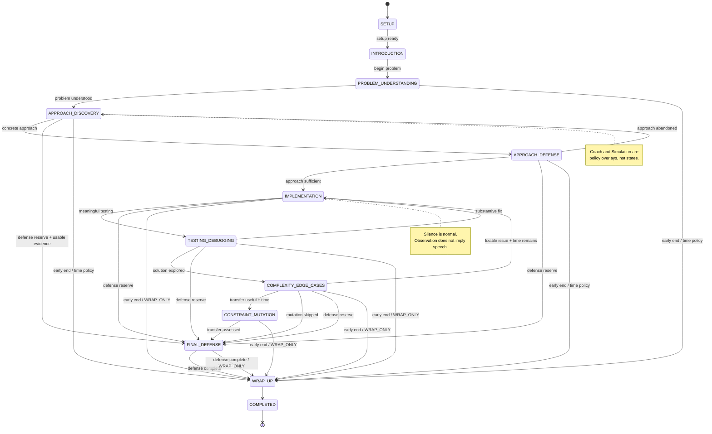

# CounterQ — Technical Interview State Machine

**Document:** `docs/examiner/STATE_MACHINE.md`  
**Status:** Frozen Phase 1 Behavioral Source of Truth  
**Product:** CounterQ  
**Phase:** Phase 1 — Technical Coding Interviews  
**Last Updated:** August 2026

---

# 1. Purpose

This document defines the deterministic behavioral state machine controlling a CounterQ technical coding interview.

It builds on:

- `docs/PRODUCT.md`
- `docs/PHASE_1.md`
- `docs/ARCHITECTURE.md`
- `docs/data/DATA_MODEL.md`

CounterQ software owns this state machine.

Language models may:

- interpret candidate behavior;
- identify possible misconceptions;
- recommend interviewer actions;
- recommend a legal transition;
- select probe targets;
- generate natural interviewer phrasing.

Language models may not independently control:

- interview stage;
- legal transitions;
- session duration;
- probe budgets;
- AI budgets;
- protected wrap-up time;
- completion;
- mastery;
- breakpoint state.

The central behavioral objective is:

> **CounterQ should behave like a technically strong human interviewer who knows when to ask, when to challenge, when to redirect, and when to remain silent.**

A defining CounterQ property is:

> **CounterQ knows when not to ask a question.**

---

# 2. Design philosophy

The state machine should provide enough deterministic structure to produce a realistic interview without turning the interaction into a rigid script.

The system must balance:

- realistic interview progression;
- candidate thinking time;
- verbal explanation;
- coding;
- testing;
- debugging;
- adaptive questioning;
- selective silence;
- time pressure;
- Coach vs Simulation behavior;
- cost limits;
- graceful recovery.

The state machine controls **when classes of behavior are appropriate**.

The Examiner Engine determines **what may be worth investigating**.

The Realtime Voice Brain determines **how an authorized conversational action should sound**.

These concerns must remain separate.

---

# 3. Stage and action are different

CounterQ distinguishes:

## Interview stage

Where the interview currently is.

Example:

```text
IMPLEMENTATION
```

## Examiner action

What CounterQ should do at this moment.

Possible Examiner recommendations:

```text
WAIT
OBSERVE
ASK
PROBE
```

A candidate may remain in `IMPLEMENTATION` for several minutes while CounterQ repeatedly chooses:

```text
WAIT
```

and:

```text
OBSERVE
```

That is correct behavior.

A state does not require CounterQ to speak.

---

# 4. Candidate-visible interviewer interaction model

Every meaningful interviewer turn is represented as:

```text
InterviewerPrompt
        ↓
PromptDelivery
        ↓
CandidateResponse
```

Prompt kinds include:

- `BASE_QUESTION`
- `CLARIFICATION`
- `PROBE`
- `TRANSITION`
- `INSTRUCTION`
- `TIME_WARNING`

Only `PROBE` requires a `ProbeStrategy`.

Examples:

### BASE_QUESTION

> "Walk me through your approach."

### CLARIFICATION

> "When you say constant space, what are you counting?"

### PROBE

> "You said always. Is that actually guaranteed?"

### TRANSITION

> "Okay. Go ahead and implement it."

### INSTRUCTION

> "Before you code, give me the high-level approach first."

### TIME_WARNING

> "We're getting close to time. Finish this block and then we'll discuss complexity."

CounterQ must persist what was actually delivered, including partial delivery if interrupted.

---

# 5. Conversation floor and prompt arbitration

Interview stage alone is not enough to control a realtime conversation.

CounterQ also maintains an **orthogonal conversation-floor controller** so that:

- candidate speech;
- CounterQ speech;
- asynchronous Examiner decisions;
- time warnings;
- reconnect behavior;

cannot produce overlapping or contradictory interviewer turns.

This is operational conversational state, not an interview lifecycle stage.

Conceptually the floor may be in states such as:

```text
CANDIDATE_SPEAKING
CANDIDATE_THINKING
COUNTERQ_SPEAKING
IDLE
INTERRUPTED
```

The exact implementation may use provider turn-detection events rather than persisting these as durable database states.

## 5.1 Candidate speech wins the floor

If CounterQ is speaking and the candidate begins speaking:

1. stop/cancel current audio output where supported;
2. mark the PromptDelivery as interrupted/partial;
3. give the candidate the floor;
4. do not begin another prompt while the candidate continues;
5. reconcile whether the interrupted prompt should later be retried, rephrased or discarded.

CounterQ must never compete with the candidate for the floor.

## 5.2 Only one candidate-visible prompt may be actively delivered

CounterQ must not deliver:

- a technical probe;
- a time warning;
- a stage transition;
- and a realtime acknowledgement

at the same time.

At most one `PromptDelivery` may own the conversational floor at once.

Other authorized prompt candidates remain pending only while still relevant and before their expiry deadline.

## 5.3 Authorized does not mean immediately spoken

An `InterviewerPrompt` may be authorized while the candidate is still speaking or coding productively.

Delivery waits for a natural boundary unless:

- system/time policy requires interruption;
- candidate explicitly requests an answer;
- the current direction would otherwise make the interview unusable.

Before actual delivery, the prompt is revalidated for:

- state version;
- event watermark;
- code version;
- target resolution;
- time;
- mode;
- prompt priority.

## 5.4 Prompt priority

When multiple candidate-visible actions are simultaneously eligible, deterministic software arbitrates them.

Conceptual priority is:

```text
SYSTEM / SAFETY / CONNECTION
        ↓
HARD TIME CONTROL
        ↓
ACTIVE PROMPT COMPLETION / RECOVERY
        ↓
REQUIRED STAGE QUESTION
        ↓
HIGH-VALUE TECHNICAL PROBE
        ↓
OPTIONAL CLARIFICATION / LOW-VALUE PROBE
        ↓
NEUTRAL ACKNOWLEDGEMENT
```

A low-value probe must never delay a required time warning or closing transition.

## 5.5 Neutral acknowledgements must not leak correctness

Realtime acknowledgements such as:

> "Okay."

or:

> "Go on."

may be used sparingly.

Avoid autonomous acknowledgements such as:

> "Exactly."
>
> "Correct."
>
> "Perfect."

in Simulation Mode because they leak evaluation signal.

## 5.6 Candidate-turn completion

A finalized transcript segment is not automatically equivalent to:

> candidate has completed their full answer.

Turn completion may consider:

- provider end-of-turn signal;
- short natural boundary;
- whether the candidate immediately continues;
- whether code activity suggests they are still explaining while implementing;
- whether the current prompt expects a multi-part response.

Deep Examiner work may begin speculatively from finalized segments, but candidate-visible follow-up should normally wait until a real conversational boundary.

---

# 6. Phase 1 lifecycle

The Phase 1 state machine is:

```text
SETUP
    ↓
INTRODUCTION
    ↓
PROBLEM_UNDERSTANDING
    ↓
APPROACH_DISCOVERY
    ↓
APPROACH_DEFENSE
    ↓
IMPLEMENTATION
    ↓
TESTING_DEBUGGING
    ↓
COMPLEXITY_EDGE_CASES
    ↓
CONSTRAINT_MUTATION
    ↓
FINAL_DEFENSE
    ↓
WRAP_UP
    ↓
COMPLETED
```

Two originally proposed states are intentionally not included.

---

# 7. Why `PROBLEM_PRESENTED` is not a state

Presenting the problem is an entry action for:

```text
PROBLEM_UNDERSTANDING
```

There is no separate behavior requiring a durable `PROBLEM_PRESENTED` stage.

Creating one would add lifecycle complexity without adding meaningful policy.

---

# 8. Why `CLARIFICATION` is not a state

Clarification is conversational behavior, not a lifecycle phase.

A candidate may ask clarification questions during:

- problem understanding;
- approach discussion;
- implementation;
- testing.

CounterQ therefore uses:

```text
prompt_kind = CLARIFICATION
```

inside the appropriate stage.

This is more natural than transitioning into and out of a `CLARIFICATION` state repeatedly.

---

# 9. Reconnect is not an interview stage

Connection loss is orthogonal to interview behavior.

The system may mark a session operationally as:

```text
RECONNECTING
```

without changing:

```text
current_stage = IMPLEMENTATION
```

When connectivity returns, the candidate resumes the same behavioral stage unless time or other policy requires progression.

Infrastructure conditions must not pollute the interview reasoning graph.

---

# 10. Session timing model

Every interview has a server-owned:

```text
session_start
session_deadline
```

plus a configurable Stage Plan.

Stage timing is controlled by configuration rather than hardcoded into state logic.

Each stage may define:

- target allocation;
- soft deadline;
- hard cap where appropriate;
- skippability;
- compression priority;
- protected downstream reserve.

---

# 11. Interview templates

The same state machine supports multiple templates.

Possible Phase 1 templates include:

### Quick Drill

Focused practice around one narrow skill or problem segment.

Characteristics:

- short introduction;
- small implementation/problem scope;
- fewer probes;
- mutation often skipped;
- still reserves a closing defense.

### Solution Defense

Candidate has an existing solution or implementation to defend.

Characteristics:

- shortened discovery;
- emphasis on explanation;
- approach defense;
- complexity;
- implementation choices;
- edge cases;
- transfer.

### Standard Coding Interview

Default end-to-end CounterQ experience.

Approximately suitable for the 25–30 minute class of interviews, while remaining configurable.

### Full Simulation

Longer session with:

- more independent implementation;
- deeper debugging;
- stronger transfer opportunity;
- more realistic interviewer pacing.

The state machine does not contain durations such as:

```text
IMPLEMENTATION = 9 minutes
```

Application configuration determines the actual values.

---

# 12. Reference stage weighting

For a Standard Coding Interview, a reasonable initial scheduling profile is approximately:

| Stage | Nominal share | Skippable | Compressible |
|---|---:|---|---|
| INTRODUCTION | 4% | No | Highly |
| PROBLEM_UNDERSTANDING | 8% | No | Yes |
| APPROACH_DISCOVERY | 13% | No | Yes |
| APPROACH_DEFENSE | 8% | Partially | Yes |
| IMPLEMENTATION | 32% | No | Limited |
| TESTING_DEBUGGING | 13% | Partially | Yes |
| COMPLEXITY_EDGE_CASES | 8% | No | Limited |
| CONSTRAINT_MUTATION | 5% | Yes | Yes |
| FINAL_DEFENSE | 6% | Normally no | Limited |
| WRAP_UP | 3% | No | No |

These are initial product-policy weights, not application constants.

The scheduling system may redistribute unused time.

For example:

```text
PROBLEM_UNDERSTANDING finishes early
        ↓
unused allocation becomes available
        ↓
IMPLEMENTATION / TESTING may receive more time
```

However, protected final-defense and wrap-up reserves cannot be consumed freely.

---

# 13. Protected time

CounterQ must reserve session time for:

- `FINAL_DEFENSE`
- `WRAP_UP`

Implementation cannot consume the entire interview simply because the candidate is still coding.

The scheduler therefore maintains:

```text
protected_final_defense_time
protected_wrap_up_time
```

When remaining time approaches these reserves:

- optional probes are suppressed;
- mutation may be skipped;
- active probe chains terminate;
- coding is brought to a natural boundary;
- the interview advances toward `FINAL_DEFENSE`, not directly to `WRAP_UP`, while the final-defense reserve remains usable.

Only when the session reaches the stricter `WRAP_ONLY` threshold, or there is genuinely insufficient time for a meaningful final defense, should CounterQ bypass `FINAL_DEFENSE` and enter `WRAP_UP`.

---

# 14. Stage timing semantics

Each stage may have:

## Target duration

Normal amount of time the interviewer expects to spend.

## Soft deadline

Crossing this does not force an immediate transition.

Instead, CounterQ becomes increasingly selective.

## Hard stage cap

Used only where allowing indefinite continuation damages the interview.

Example:

`IMPLEMENTATION` cannot consume protected final-defense time.

## Session deadline

Absolute server-owned boundary.

An LLM cannot modify it.

---

# 15. Common state policy

Every stage evaluates:

```text
current_stage
mode
candidate_level
time_remaining
stage_time_elapsed
candidate_activity
current_prompt
probe_budget
probe_chain_depth
recent_probe_history
code_version
event_watermark
examiner_candidates
cost_pressure
```

before authorizing candidate-visible intervention.

## Stage transition while a prompt is active

CounterQ should not casually transition stages while a candidate-visible prompt is:

- actively being delivered;
- only partially delivered;
- awaiting an immediate response that materially defines the current stage.

Before a normal transition, the orchestrator should:

1. finish or cancel the active PromptDelivery;
2. decide whether an interrupted prompt remains relevant;
3. close/group any CandidateResponse that is already semantically complete;
4. persist the transition;
5. invalidate stage-bound Examiner decisions.

Exceptions include:

- hard time control;
- candidate-requested early termination;
- infrastructure failure;
- safety/system interruption.

A stage transition must never cause two simultaneous prompts or leave an old-stage question ambiguously active.

---

# 16. SETUP

## Purpose

Prepare the interview before the candidate-facing timed experience begins.

## Entry conditions

- authenticated user;
- valid InterviewConfiguration;
- valid ProblemVersion;
- valid InterviewPackVersion;
- valid supported language;
- microphone requirements satisfied;
- session budgets created.

## Entry actions

CounterQ:

- loads Interview Pack;
- loads relevant candidate mastery;
- loads unresolved relevant breakpoints;
- initializes budgets;
- initializes state version;
- prepares realtime provider session;
- verifies code execution capability;
- prepares initial problem context.

## Candidate behavior expected

None beyond permissions/connectivity.

## Important observations

- microphone availability;
- realtime provider readiness;
- browser support;
- editor readiness.

## Allowed prompt types

Normally none.

UI instructions are preferable to spoken interview prompts.

## Allowed probes

None.

## Silence behavior

Irrelevant.

## Allowed outgoing transitions

```text
SETUP → INTRODUCTION
```

or terminal setup failure.

## Transition guard

All critical interview dependencies must be usable.

## Timeout behavior

The candidate-facing interview clock should not normally start while CounterQ itself is still preparing.

If setup fails:

- do not burn interview time;
- present recovery;
- do not create fake interview evidence.

## Coach vs Simulation

No meaningful difference.

---

# 17. INTRODUCTION

## Purpose

Establish a natural interviewer presence and explain minimal interview expectations.

The introduction should be short.

CounterQ is not giving a product tutorial.

## Entry conditions

Successful SETUP.

## Entry actions

- start authoritative interview timing;
- greet candidate;
- establish interaction expectations;
- confirm readiness where useful.

Example:

> "We'll work through the problem together like a technical interview. Explain your thinking as you go, and I'll ask questions when needed."

Simulation should avoid describing internal evaluation machinery.

## Candidate behavior expected

- acknowledge readiness;
- ask brief procedural question if needed.

## Important observations

Very little technical evidence should be inferred here.

## Allowed prompt types

- `BASE_QUESTION`
- `CLARIFICATION`
- `INSTRUCTION`
- `TRANSITION`

## Allowed probes

None.

## Silence behavior

A short pause is normal.

Prolonged silence with no connection problem may prompt:

> "Ready to begin?"

## Outgoing transition

```text
INTRODUCTION → PROBLEM_UNDERSTANDING
```

## Guard

Candidate ready or introduction soft deadline reached.

## Timeout

Automatically transition to problem presentation.

## Coach Mode

May briefly explain that assistance is available if the candidate becomes stuck.

## Simulation Mode

Keep introduction minimal and interview-like.

---

# 18. PROBLEM_UNDERSTANDING

## Purpose

Determine whether the candidate understands what is being asked before meaningful solution development begins.

Problem presentation occurs on entry.

## Entry actions

- show problem;
- provide problem verbally where appropriate;
- establish constraints;
- invite candidate to restate or reason about the task.

Possible BASE_QUESTION:

> "Take a moment to read it, then tell me how you understand the problem."

## Candidate behavior expected

- read problem;
- restate objective;
- identify inputs/outputs;
- ask clarification questions;
- identify basic constraints.

## Important observations

CounterQ cares about:

- requirement misunderstandings;
- hidden assumptions;
- confusion about output;
- candidate clarification behavior;
- important constraint recognition;
- premature solution assumptions.

## Allowed prompt types

- `BASE_QUESTION`
- `CLARIFICATION`
- `PROBE`
- `INSTRUCTION`
- `TRANSITION`
- `TIME_WARNING`

## Allowed ProbeStrategies

Primarily:

- `ASSUMPTION_CHALLENGE`
- `EDGE_CASE`
- `WHY`

Probing should remain sparse.

## Silence behavior

Reading silence is normal.

Do not interrupt merely because the candidate has not spoken for a few seconds.

If no speech and no visible activity persists beyond configured reading/thinking tolerance, a neutral prompt may be used.

## Outgoing transitions

```text
PROBLEM_UNDERSTANDING → APPROACH_DISCOVERY
```

## Transition guard

Candidate demonstrates usable understanding of:

- task;
- important input/output semantics;
- core constraints.

Perfect restatement is unnecessary.

## Timeout behavior

If understanding remains incomplete:

### Simulation

Clarify only factual requirements necessary to continue.

Do not teach the approach.

### Coach

May explicitly resolve a requirement misunderstanding before moving forward.

## Candidate starts coding here

CounterQ checks whether a usable approach has already been articulated.

If not:

> "Before you implement, walk me through the approach you're planning."

Do not physically lock the editor.

The behavioral goal is explanation, not UI enforcement.

---

# 19. APPROACH_DISCOVERY

## Purpose

Allow the candidate to think, explore and form a solution.

This state should feel spacious.

CounterQ must not interrogate every incomplete idea.

## Entry conditions

Problem sufficiently understood.

## Entry actions

Ask an open-ended BASE_QUESTION if necessary:

> "How would you approach it?"

## Candidate behavior expected

- think aloud;
- consider brute force;
- identify patterns;
- propose data structures;
- revise approach;
- estimate direction.

## Important observations

- candidate reasoning path;
- concept recognition;
- assumptions;
- alternative approaches;
- uncertainty;
- premature optimization;
- candidate self-correction.

## Allowed prompt types

- `BASE_QUESTION`
- `CLARIFICATION`
- `PROBE`
- `INSTRUCTION`
- `TRANSITION`
- `TIME_WARNING`

## Allowed ProbeStrategies

Potentially:

- `WHY`
- `ASSUMPTION_CHALLENGE`
- `COMPLEXITY`
- `ALTERNATIVE`
- `EDGE_CASE`

Threshold for probing should still be moderate to high because ideas are not yet commitments.

## Silence behavior

Thinking silence is expected.

CounterQ should tolerate:

```text
silence + no typing + candidate visibly considering
```

for substantially longer than ordinary conversational silence.

A short pause after:

> "How would you approach it?"

must not trigger rescue.

## Outgoing transitions

```text
APPROACH_DISCOVERY → APPROACH_DEFENSE
```

or, when the candidate substantially restarts:

```text
APPROACH_DISCOVERY → APPROACH_DISCOVERY
```

No transition is required for ordinary idea refinement.

## Transition guard

Candidate has a sufficiently concrete proposed solution to interrogate.

At minimum, the approach should usually establish:

- main algorithmic idea;
- key data structure/state;
- broad processing flow.

## Timeout behavior

If candidate remains unproductive:

### Simulation

Use a neutral prompt such as:

> "What would a straightforward solution look like first?"

This is not correctness feedback.

### Coach

Hint ladder may begin.

---

# 20. APPROACH_DEFENSE

## Purpose

Determine whether the proposed approach is understood deeply enough to justify implementation.

This is one of the highest-value probing states.

## Entry conditions

Candidate has proposed a concrete approach.

## Entry actions

No mandatory new question if the candidate is already explaining.

Otherwise:

> "Walk me through why this approach works."

## Candidate behavior expected

- justify algorithm;
- explain key invariant;
- discuss data structure;
- explain complexity;
- address obvious edge cases;
- respond to challenge.

## Important observations

- correctness reasoning;
- memorized vs understood approach;
- unjustified assumptions;
- complexity misconceptions;
- missing invariant;
- trade-off understanding.

## Allowed prompt types

All prompt kinds.

## Allowed ProbeStrategies

- `WHY`
- `PROVE`
- `ASSUMPTION_CHALLENGE`
- `COUNTEREXAMPLE`
- `COMPLEXITY`
- `EDGE_CASE`
- `TRADE_OFF`
- `ALTERNATIVE`

## Silence behavior

Candidate may pause while reasoning.

After a direct technical probe, allow real thinking time.

Do not rescue immediately.

## Outgoing transitions

Primary:

```text
APPROACH_DEFENSE → IMPLEMENTATION
```

Fallback:

```text
APPROACH_DEFENSE → APPROACH_DISCOVERY
```

if the candidate abandons the approach.

## Transition guard

CounterQ does not require proof of every detail.

The approach should be sufficiently coherent that implementation is a useful next step.

A candidate may still have unresolved probe targets.

Those can remain queued.

## Timeout behavior

Do not exhaust interview time proving theory before coding.

When stage soft deadline is exceeded:

- stop low-value probe chains;
- preserve unresolved high-value target for FINAL_DEFENSE;
- transition to implementation.

## Coach Mode

May resolve a major conceptual gap using hints before implementation.

## Simulation Mode

Avoid teaching.

If the approach is flawed but still informative, the candidate may be allowed to implement enough to expose the problem naturally.

---

# 21. IMPLEMENTATION

## Purpose

Allow the candidate to convert their reasoning into code while CounterQ primarily observes.

This is intentionally a **low-interruption state**.

## Entry conditions

Usable implementation direction exists.

## Entry actions

Typical transition:

> "Okay. Go ahead and implement it."

## Candidate behavior expected

- code;
- explain meaningful choices;
- revise implementation;
- occasionally ask questions;
- possibly run partial code.

## Important observations

- current source;
- meaningful diffs;
- key control flow;
- data structure choices;
- invariant implementation;
- repeated code churn;
- candidate explanation vs actual code;
- independent correction.

## Allowed prompt types

- `CLARIFICATION`
- `PROBE`
- `TRANSITION`
- `INSTRUCTION`
- `TIME_WARNING`

`BASE_QUESTION` should be rare unless natural interaction requires it.

## Allowed ProbeStrategies

Primarily:

- `IMPLEMENTATION_CHOICE`
- `PROVE`
- `EDGE_CASE`
- `FAILURE_MODE`
- `COUNTEREXAMPLE`

Probing threshold is deliberately high.

## Silence behavior

```text
silence + active typing
```

means:

> candidate is coding.

CounterQ should generally remain silent.

No "Are you still there?"

No forced think-aloud every few seconds.

## Outgoing transitions

Typical:

```text
IMPLEMENTATION → TESTING_DEBUGGING
```

Possible fallback:

```text
IMPLEMENTATION → APPROACH_DISCOVERY
```

when candidate explicitly abandons the algorithm.

Possible brief loop:

```text
IMPLEMENTATION → IMPLEMENTATION
```

for ordinary edits.

## Transition guard

Testing stage becomes appropriate when:

- candidate initiates meaningful run/test;
- candidate declares implementation ready;
- implementation is substantially complete;
- time policy requires movement.

A trivial compile check does not necessarily require a stage change.

---

# 22. Coding interruption policy

CounterQ should usually not interrupt implementation merely because a potential issue appears.

Suppose the candidate writes:

```text
left = last[s[right]] + 1
```

where `left` may move backwards.

The Observation Engine may produce:

```text
possible invariant violation
```

The Examiner Engine may prepare:

```text
PROBE candidate:
"What guarantees that left never moves backwards?"
```

CounterQ should wait for a natural boundary.

Preferred opportunities include:

1. candidate finishes the logical block;
2. candidate verbally explains the block;
3. candidate pauses and appears ready for interaction;
4. candidate says they are about to run;
5. a test result exposes the behavior;
6. FINAL_DEFENSE if intervention earlier would be unnecessarily disruptive.

---

# 23. When implementation probing is justified

A live implementation probe should normally require one or more of:

- high confidence;
- high conceptual importance;
- candidate explicitly claimed correctness of the relevant logic;
- waiting significantly reduces diagnostic value;
- candidate is committing deeply to an invalid path;
- test execution would obscure useful reasoning;
- target is central to the interview.

A cosmetic or low-impact issue does not justify interruption.

---

# 24. When CounterQ should deliberately wait

Do not probe yet when:

- candidate is actively modifying the suspicious code;
- issue may be ordinary incomplete implementation;
- candidate has just noticed something;
- candidate is tracing relevant logic;
- candidate has not claimed the block is correct;
- self-correction would provide stronger evidence;
- candidate is in a productive flow.

Waiting is not inactivity.

It is an interviewing decision.

---

# 25. Self-correction

Self-correction is a first-class behavioral outcome.

Example:

1. Code v17 contains potential bug.
2. Examiner begins analysis.
3. Candidate pauses.
4. Candidate says:
   > "Actually this could move left backward."
5. Candidate updates to v18.
6. Pending decision references v17.
7. State/policy gate detects resolution.
8. Probe becomes `STALE`.
9. CounterQ remains silent.
10. Evidence may record independent correction.

Possible Evidence:

```text
polarity = POSITIVE
skill = debugging
independence = INDEPENDENT
finding = candidate identified and corrected invariant violation without interviewer assistance
```

CounterQ should never ask the stale question merely because inference was paid for.

---

# 26. TESTING_DEBUGGING

## Purpose

Observe how the candidate validates and debugs the implementation.

Testing behavior itself is valuable evidence.

## Entry conditions

Meaningful execution/testing begins or implementation is substantially complete.

## Candidate behavior expected

- run code;
- manually trace;
- inspect failure;
- form debugging hypothesis;
- edit;
- rerun;
- test edge cases.

## Important observations

- chosen test cases;
- compiler failures;
- runtime failures;
- test failures;
- debugging sequence;
- repeated failures;
- self-correction;
- reliance on CounterQ;
- candidate explanation.

## Allowed prompt types

- `BASE_QUESTION`
- `CLARIFICATION`
- `PROBE`
- `INSTRUCTION`
- `TRANSITION`
- `TIME_WARNING`

## Allowed ProbeStrategies

- `FAILURE_MODE`
- `EDGE_CASE`
- `COUNTEREXAMPLE`
- `IMPLEMENTATION_CHOICE`
- `PROVE`
- `WHY`

## Silence behavior

A failed test is **not** an automatic prompt trigger.

Default behavior after a failure:

```text
OBSERVE
```

Give the candidate an opportunity to debug independently.

## Outgoing transitions

If candidate needs code modification:

```text
TESTING_DEBUGGING → IMPLEMENTATION
```

when work returns to substantial implementation.

When solution is sufficiently explored:

```text
TESTING_DEBUGGING → COMPLEXITY_EDGE_CASES
```

## Timeout behavior

When time is constrained:

- stop chasing implementation perfection;
- preserve existing evidence;
- move to explicit reasoning/defense.

## Coach Mode

May use debugging hints after clear stuck evidence.

## Simulation Mode

Remain neutral longer.

---

# 27. Run/test behavior

## Run clicked

Persist:

- exact code snapshot;
- execution request;
- result.

Do not assume Run means:

> candidate is done.

## Compile failure

Default:

```text
OBSERVE
```

Let the candidate inspect it.

A simple syntax error is usually low-value interview evidence.

## Runtime failure

Observe candidate diagnosis before intervening.

## Test failure

Do not immediately explain.

Potential later interviewer prompt:

> "Can you walk through what happens on `abba`?"

This tests reasoning without revealing the bug.

## Passing tests

Passing visible tests does not establish correctness.

CounterQ may still evaluate:

- missing edge cases;
- complexity;
- assumptions;
- invariant correctness.

## Candidate manually traces example

Treat this as testing behavior even without clicking Run.

## Candidate declares solution complete

This creates a high-value validation event.

CounterQ should normally ensure:

- implementation has been considered;
- complexity/edge cases are covered;
- final defense remains possible.

---

# 28. COMPLEXITY_EDGE_CASES

## Purpose

Verify reasoning that may not have been fully tested during coding.

Code acceptance does not end the interview.

## Entry conditions

Candidate has reached a sufficiently stable solution or session time requires moving beyond implementation.

## Entry actions

Select **remaining evidence gaps** rather than blindly asking a checklist.

Possible BASE_QUESTION:

> "What's the time and space complexity of this implementation?"

## Candidate behavior expected

- explain time complexity;
- explain space complexity;
- identify assumptions;
- discuss edge cases;
- justify correctness where needed.

## Important observations

- complexity accuracy;
- amortized reasoning;
- hidden auxiliary space;
- edge cases;
- relationship between claimed and actual code behavior.

## Allowed prompt types

All except routine implementation instruction.

## Allowed ProbeStrategies

- `COMPLEXITY`
- `EDGE_CASE`
- `PROVE`
- `COUNTEREXAMPLE`
- `TRADE_OFF`
- `ASSUMPTION_CHALLENGE`

## Silence behavior

Allow thinking time after technical questions.

## Outgoing transitions

Normally:

```text
COMPLEXITY_EDGE_CASES → CONSTRAINT_MUTATION
```

or:

```text
COMPLEXITY_EDGE_CASES → FINAL_DEFENSE
```

when mutation should be skipped.

Possible repair transition if a serious issue emerges and enough time remains:

```text
COMPLEXITY_EDGE_CASES → IMPLEMENTATION
```

or:

```text
COMPLEXITY_EDGE_CASES → TESTING_DEBUGGING
```

## Avoiding duplicate questions

Before asking complexity or edge-case questions, inspect existing Evidence.

If complexity has already been:

- stated;
- challenged;
- correctly defended;

do not ask:

> "What is the complexity?"

again merely because the lifecycle reached this stage.

Instead test another gap or shorten the stage.

---

# 29. CONSTRAINT_MUTATION

## Purpose

Test whether understanding transfers when an important assumption changes.

This is not a trick-question stage.

A mutation should reveal whether the candidate understands the structure of the solution.

## Examples

Original:

> Longest substring without repeating characters.

Mutation:

> "What changes if the input arrives as a stream?"

or:

> "Suppose the character domain is fixed and very small. Would you change anything?"

Other examples:

- memory limit becomes much tighter;
- data no longer fits in memory;
- graph receives negative edges;
- sorted input becomes unsorted;
- random access becomes unavailable.

## Entry conditions

All must generally hold:

- suitable problem;
- sufficient time;
- enough original-solution understanding established;
- useful transfer opportunity exists.

## Candidate behavior expected

- identify affected assumptions;
- adapt approach;
- explain trade-offs;
- reject invalid original assumptions.

## Important observations

- transfer;
- conceptual depth;
- adaptability;
- memorization vs understanding.

## Allowed prompt types

- `BASE_QUESTION`
- `CLARIFICATION`
- `PROBE`
- `TRANSITION`
- `TIME_WARNING`

## Allowed ProbeStrategies

Primarily:

- `CONSTRAINT_MUTATION`
- `TRANSFER`
- `TRADE_OFF`
- `ALTERNATIVE`
- `FAILURE_MODE`

## Silence behavior

A mutation often requires substantial thinking.

Do not rush the candidate.

## Outgoing transition

```text
CONSTRAINT_MUTATION → FINAL_DEFENSE
```

## Skip conditions

Skip if:

- protected time is threatened;
- problem has no useful mutation;
- candidate level makes mutation inappropriate;
- candidate never established adequate original understanding;
- major unresolved fundamental weakness is more valuable to examine;
- probe budget is exhausted.

Skipping mutation is not a session failure.

---

# 30. FINAL_DEFENSE

## Purpose

Perform a concise last technical verification before closing.

This is **not** another full questioning round.

The state exists to preserve one final high-value opportunity after implementation.

## Entry conditions

Main interview work substantially complete or protected final-defense reserve reached.

## Entry actions

Select the highest-value unresolved target using existing session evidence.

Possible goals:

- key invariant;
- complexity;
- trade-off;
- implementation decision;
- unresolved claim;
- concise correctness argument.

## Candidate behavior expected

One or a small number of focused responses.

## Important observations

- ability to summarize;
- ability to defend;
- whether earlier uncertainty remains;
- whether candidate can articulate the core idea under pressure.

## Allowed prompt types

- `BASE_QUESTION`
- `CLARIFICATION`
- `PROBE`
- `TIME_WARNING`
- `TRANSITION`

## Allowed ProbeStrategies

Any strategy appropriate to the unresolved target, especially:

- `PROVE`
- `WHY`
- `COMPLEXITY`
- `TRADE_OFF`
- `IMPLEMENTATION_CHOICE`

## Silence behavior

Allow genuine thinking time.

## Outgoing transition

```text
FINAL_DEFENSE → WRAP_UP
```

## Timeout

Do not begin a multi-step probe chain when wrap-up reserve has been reached.

## No duplication rule

If the session already has strong evidence for:

- correctness;
- complexity;
- invariant;

choose another useful unresolved target.

If no meaningful unresolved target exists, keep the final defense short.

---

# 31. WRAP_UP

## Purpose

Close the interview naturally and on time.

## Entry conditions

- normal lifecycle complete;
- session deadline approaching;
- candidate elects to finish;
- time policy forces closure.

## Entry actions

- cancel optional outstanding reasoning;
- stop new probe chains;
- mark final candidate evidence boundary;
- close conversationally.

## Allowed prompt types

- `TRANSITION`
- `INSTRUCTION`

A concise `TIME_WARNING` may precede entry.

## Allowed probes

None.

Do not discover a fascinating new concept during wrap-up and restart the interview.

## Candidate behavior expected

Minimal closing interaction.

## Coach Mode

May mention that detailed feedback will follow.

Do not turn wrap-up into an unstructured tutoring session.

## Simulation Mode

Neutral professional closing.

## Outgoing transition

```text
WRAP_UP → COMPLETED
```

---

# 32. COMPLETED

Terminal behavioral stage.

Once completed:

- candidate-visible interview conversation ends;
- live Examiner tasks are cancelled;
- no new candidate evidence is accepted as part of the interview;
- post-session jobs may begin;
- report generation may begin;
- CounterMap materialization may begin;
- mastery aggregation may begin;
- retest generation may begin.

Representative illegal transition:

```text
COMPLETED → IMPLEMENTATION
```

always fails.

---

# 33. Prompt legality by state

| Stage | BASE | CLARIFY | PROBE | TRANSITION | INSTRUCTION | TIME WARNING |
|---|---:|---:|---:|---:|---:|---:|
| SETUP | No | No | No | No | UI only | No |
| INTRODUCTION | Yes | Yes | No | Yes | Yes | Rare |
| PROBLEM_UNDERSTANDING | Yes | Yes | Limited | Yes | Yes | Yes |
| APPROACH_DISCOVERY | Yes | Yes | Limited | Yes | Yes | Yes |
| APPROACH_DEFENSE | Yes | Yes | Yes | Yes | Yes | Yes |
| IMPLEMENTATION | Rare | Yes | High threshold | Yes | Yes | Yes |
| TESTING_DEBUGGING | Yes | Yes | Yes | Yes | Yes | Yes |
| COMPLEXITY_EDGE_CASES | Yes | Yes | Yes | Yes | Rare | Yes |
| CONSTRAINT_MUTATION | Yes | Yes | Yes | Yes | Rare | Yes |
| FINAL_DEFENSE | Yes | Yes | Yes | Yes | Rare | Yes |
| WRAP_UP | No | Rare | No | Yes | Yes | No |
| COMPLETED | No | No | No | No | No | No |

---

# 34. Realtime Voice Brain permissions

The Realtime Brain may act autonomously only within low-risk conversational boundaries.

## Globally allowed

Without deep Examiner reasoning, it may:

- acknowledge candidate speech without judging correctness;
- repeat known problem facts;
- answer factual procedural questions;
- ask candidate to continue;
- deliver an already-authorized InterviewerPrompt;
- handle interruption naturally;
- provide server-authorized time warnings;
- perform natural conversational transitions already permitted by state policy.

## Globally prohibited

It may not independently:

- accuse the candidate of a technical misconception;
- reveal a suspected bug;
- authoritatively assess correctness;
- create Breakpoints;
- alter Mastery;
- extend interview duration;
- increase budgets;
- transition stages illegally;
- invent a constraint mutation not approved by policy;
- expose solution content in Simulation Mode.

---

# 35. State-specific Realtime Brain autonomy

### PROBLEM_UNDERSTANDING

May answer factual problem clarifications from the verified Interview Pack.

Must not guide solution choice.

### APPROACH_DISCOVERY

May ask neutral continuation questions.

Technical challenge should normally involve Examiner reasoning.

### APPROACH_DEFENSE

May deliver authorized technical prompts.

Must not invent an accusation independently.

### IMPLEMENTATION

Should mostly manage conversational continuity and silence.

No autonomous bug commentary.

### TESTING_DEBUGGING

May acknowledge execution events conversationally if necessary.

Must not explain a failure without appropriate policy.

### COMPLEXITY / MUTATION / FINAL DEFENSE

Technical challenge should come from approved examiner context.

---

# 36. Silence model

Silence is classified using deterministic contextual signals before any AI analysis is considered.

CounterQ distinguishes four broad forms.

---

# 37. Thinking silence

Typical signals:

- recent technical question;
- no speech;
- little/no typing;
- no disconnect;
- candidate has not indicated completion.

Common in:

- approach discovery;
- approach defense;
- final defense;
- constraint mutation.

Policy:

> Wait.

Do not interpret thinking latency as incompetence.

---

# 38. Coding silence

Typical signals:

- no speech;
- active editor changes;
- cursor/code activity;
- implementation stage.

Policy:

> Remain silent.

This is normal interview behavior.

---

# 39. Uncertain or stuck silence

Potential signals:

- prolonged inactivity beyond state-specific tolerance;
- repeated undo/rewrite cycles;
- explicit "I'm stuck";
- repeated failed executions;
- unresolved direct prompt;
- no productive code change;
- candidate appears unable to advance.

No single signal proves the candidate is stuck.

CounterQ should combine several signals.

---

# 40. Connection-failure silence

Signals:

- realtime heartbeat loss;
- WebSocket loss;
- provider disconnect;
- microphone transport failure.

Policy:

> Treat as infrastructure/network state, not candidate behavior.

Never generate negative Evidence from connection-failure silence.

---

# 41. Silence evaluation must not poll an LLM continuously

CounterQ does not perform:

```text
every second:
    ask model "is candidate stuck?"
```

Instead deterministic timers and activity signals may generate:

```text
unusual_pause
```

only when a configured contextual threshold is crossed.

That event may then justify higher-level interpretation.

---

# 42. Interruption policy

Default rule:

> **Do not interrupt a productive candidate explanation merely because an interesting claim appeared.**

The Observation Engine may identify a potential target while the candidate continues speaking.

That target should normally wait for a natural conversational boundary.

---

# 43. Natural probe boundaries

Good moments include:

- candidate completes a sentence/turn;
- candidate explicitly asks for feedback;
- candidate pauses after making the relevant claim;
- candidate finishes explaining an approach;
- candidate finishes a logical code block;
- candidate declares implementation ready;
- before or after execution where diagnostically useful.

---

# 44. Exceptional interruption cases

CounterQ may interrupt when:

### Major problem misunderstanding

The candidate is spending substantial interview time solving the wrong task.

### Irrecoverably invalid direction

The candidate is committing significant remaining time to a path that prevents meaningful interview evaluation.

Even then, prefer a question.

### Severe relevance drift

Candidate is consuming the session discussing unrelated material.

### Candidate requests confirmation

CounterQ must answer according to mode policy.

### System/time issue

Example:

> "I'm going to stop you there because we're nearly out of time."

Technical curiosity alone is not enough justification.

---

# 45. Candidate asks clarification questions

Candidate questions must be classified by intent.

---

# 46. Factual problem clarification

Example:

> "Can the input contain duplicates?"

CounterQ may answer from verified ProblemVersion/Interview Pack.

This should not require deep reasoning.

---

# 47. Library/tool clarification

Example:

> "Can I use a priority queue from the standard library?"

Answer according to interview configuration.

Normally yes unless the problem specifically tests its implementation.

---

# 48. Correctness-seeking question

Example:

> "Am I on the right track?"

## Simulation Mode

Do not simply answer:

> "Yes."

Prefer interviewer-style behavior:

> "Keep going. What invariant are you relying on?"

or:

> "Walk me through why you think this handles the duplicate case."

The candidate remains responsible for validating the approach.

## Coach Mode

Limited directional feedback may be allowed.

Example:

> "The overall direction is reasonable, but I want you to verify what happens when a character repeats inside the current window."

Assistance level must be recorded.

---

# 49. Candidate starts coding too early

CounterQ should not rigidly block coding.

The policy considers:

- whether an approach has already been explained;
- candidate mode;
- current evidence;
- time remaining.

If no usable approach has been articulated:

> "Before you implement it, walk me through what you're planning."

If the candidate has already explained enough:

Transition naturally to IMPLEMENTATION.

Do not ask them to repeat themselves merely to satisfy the state machine.

---

# 50. Stuck detection

"Stuck" is a policy conclusion based on combined evidence.

Signals may include:

- explicit admission;
- long non-productive silence;
- repeated failed attempts;
- repeated code churn without progress;
- repeated execution failures;
- inability to answer a direct question;
- repeatedly returning to an already rejected idea.

The model must distinguish:

```text
slow but productive
```

from:

```text
genuinely unable to progress
```

Time alone is insufficient.

---

# 51. Coach Mode hint ladder

Hints are separate from normal adaptive probes.

In the persisted interaction model, Coach hints should normally use:

```text
InterviewerPrompt.kind = INSTRUCTION
```

with explicit assistance metadata such as:

```text
assistance_type = COACH_HINT
hint_level = <configured level>
```

They must not be mislabeled as `PROBE`, because their purpose is to assist rather than independently test understanding.

The Coach hint ladder may progress approximately as follows.

## Level 0 — Wait

Give the candidate more time.

## Level 1 — Metacognitive prompt

Example:

> "What part of the approach feels uncertain right now?"

No solution content.

## Level 2 — Narrow the problem

Example:

> "Try walking through the smallest example where a repeated character appears."

## Level 3 — Conceptual direction

Example:

> "What information would let you know where the valid window can start?"

Still avoids implementation answer.

## Level 4 — Strong structural hint

Example:

> "You may want to track the most recent position where each character appeared."

This materially assists solution discovery.

## Level 5 — Teaching intervention

CounterQ may explain the concept after sufficient struggle.

At this point:

- independent assessment has already been captured;
- Evidence records strong assistance dependency;
- candidate may then retry.

The exact number of hint levels is policy-configurable.

---

# 52. Simulation Mode stuck behavior

Simulation does not use the full Coach hint ladder.

Possible progression:

1. wait;
2. neutral clarification;
3. ask for a simpler/brute-force approach;
4. redirect to a useful interview boundary;
5. move forward when remaining time makes continued struggle low-value.

Simulation should not reveal the intended solution merely to ensure completion.

---

# 53. Probe authorization lifecycle

For an adaptive probe:

```text
ExaminerDecision
        ↓
Policy Gate
        ↓
InterviewerPrompt(kind=PROBE)
        ↓
PromptDelivery
        ↓
CandidateResponse
```

Before authorization, CounterQ verifies:

- current state allows PROBE;
- target still exists;
- candidate is not actively speaking;
- current code version remains relevant;
- source state version remains valid;
- ExaminerDecision has not expired;
- probe budget remains;
- concept cooldown permits it;
- candidate has not already resolved the target;
- similar probe was not already asked;
- enough time remains;
- mode permits the proposed depth.

Failure of any important guard may result in:

```text
REJECTED
STALE
EXPIRED
BUDGET_DENIED
SUPERSEDED
```

## Probe-budget consumption semantics

`max_probes` is a candidate-experience budget, not a count of every internal model idea.

Therefore:

- `ExaminerDecision(PROBE)` does **not** consume probe budget;
- rejected/stale/expired probe candidates do **not** consume probe budget;
- an authorized probe that is cancelled before meaningful delivery does not normally consume probe budget;
- a probe consumes budget when enough of the `PromptDelivery` has actually reached the candidate to constitute a real technical challenge;
- a rephrasing of an interrupted probe should not automatically count as a second probe when it is clearly the same interrogation intent.

AI reasoning cost is accounted separately even when the resulting probe is never delivered.

This distinction prevents stale or suppressed internal reasoning from reducing the candidate's usable interview depth.

---

# 54. Examiner usefulness deadlines

Examiner work must have an interaction-specific usefulness policy.

Possible expiry classes include:

## Turn-bound

Useful only around the current candidate turn.

Expires when the conversation materially advances.

## Code-version-bound

Useful while relevant code structure remains unchanged.

Expires when meaningful edits resolve or invalidate the target.

## Stage-bound

Useful only in the current interview stage.

Expires on state transition.

## Prompt-bound

Expires once another interviewer prompt makes the recommendation redundant.

## Session-bound

May remain relevant for later evidence/reporting even if no longer suitable for live delivery.

Candidate-visible probes should generally have stricter expiry than post-session assessment.

---

# 55. Stale decision policy

A probe must be rejected as stale if, for example:

- candidate corrected the code;
- candidate corrected the verbal claim;
- code snapshot changed materially;
- another probe already established the answer;
- interview stage changed and target no longer fits;
- Examiner deadline expired.

CounterQ should prefer:

> losing one expensive reasoning result

over:

> asking one obviously stale question.

---

# 56. Probe cooldown

CounterQ must avoid machine-gun questioning.

Probe policy should include configurable:

```text
minimum_conversational_spacing
same_concept_cooldown
max_consecutive_probes
max_probe_chain_depth
```

These values belong to configuration, not state-machine constants.

---

# 57. Consecutive probe policy

Default conceptual behavior:

```text
main question
    ↓
candidate response
    ↓
one meaningful probe
    ↓
candidate response
```

Then normally return to the main interview.

A second consecutive probe requires stronger justification.

A third should be rare.

The burden of proof increases with each probe in the chain.

---

# 58. Same-concept cooldown

After probing one concept, CounterQ should not repeatedly return to it unless:

- candidate introduces materially new reasoning;
- first answer remains genuinely unresolved;
- concept is central to correctness;
- final defense intentionally revisits unresolved evidence.

Cooldown is semantic, not merely temporal.

---

# 59. Probe depth

Probe chains exist to establish a breakpoint, not exhaust every possible question.

Example:

Candidate:

> "`unordered_map` is always O(1)."

CounterQ:

> "You said always. Is that guaranteed?"

### Candidate answers correctly

> "No. Average case is O(1), but collisions can make the worst case linear."

Policy:

```text
STOP PROBING
```

Useful evidence has been obtained.

Do not ask:

> "And what is a collision?"

simply because more questions are possible.

---

# 60. Probe depth on persistent misconception

Candidate:

> "Yes, it's always O(1)."

CounterQ may continue:

> "What happens when multiple keys collide?"

If candidate still cannot reason:

> "What could that imply for lookup time in the worst case?"

At that point, sufficient negative evidence may exist.

Stop.

Do not conduct an oral exam on hash-table implementation unless that depth is relevant to the configured candidate level.

---

# 61. Probe-chain termination rules

A probe chain should terminate when any of these occur:

### Understanding demonstrated

Candidate answers correctly with sufficient depth.

### Breakpoint established

Additional questioning is unlikely to materially improve diagnosis.

### Candidate self-corrects

Record evidence and stop.

### Candidate requires teaching

In Coach Mode, transition to hint/teaching policy rather than endless probing.

### Time pressure

Protected session time takes priority.

### Probe budget pressure

Reserve capacity for other concepts.

### Concept relevance decreases

Resume primary interview.

### Candidate confidence is already clearly calibrated

No need to overprove.

---

# 62. Probe depth factors

Allowed depth depends on:

- candidate level;
- concept importance;
- initial answer quality;
- previous evidence;
- mode;
- time remaining;
- probe budget;
- session goals.

Strong candidates generally receive deeper:

- proof;
- trade-off;
- transfer;
- constraint questions.

Weak candidates may receive enough follow-up to determine:

> fundamental misunderstanding or momentary mistake?

Then CounterQ should move on.

---

# 63. Difficulty adaptation

Difficulty adapts **inside** the configured interview level.

It does not silently transform:

```text
NEW_GRAD
```

into:

```text
senior systems interview
```

---

# 64. What may adapt

CounterQ may adapt:

- probe depth;
- conceptual abstraction;
- edge-case difficulty;
- mutation difficulty;
- amount of proof requested;
- Coach hint strength;
- number of follow-ups.

---

# 65. What remains fixed

The following remain software-controlled:

- candidate level;
- mode;
- interview duration;
- maximum probes;
- problem identity;
- legal states;
- hard budgets;
- completion deadline.

The LLM cannot make an interview harder indefinitely because the candidate appears strong.

---

# 66. Strong-performance behavior

When the candidate repeatedly demonstrates strong understanding:

CounterQ should not create artificial faults.

Instead it may increase depth through:

- proof;
- trade-offs;
- alternate approaches;
- transfer;
- constraint mutation.

A strong candidate should experience:

> harder reasoning

not:

> more nitpicking.

---

# 67. Weak-performance behavior

Weak performance should not trigger constant correction.

CounterQ should determine:

- Is this a conceptual misconception?
- Is this implementation noise?
- Is this communication difficulty?
- Is the candidate simply under pressure?
- Is one probe enough to establish the evidence?

Coach may then assist.

Simulation should preserve diagnostic integrity.

---

# 68. Time-pressure modes

The deterministic scheduler maintains time-pressure levels.

Conceptually:

```text
NORMAL
    ↓
CONSTRAINED
    ↓
DEFENSE_RESERVED
    ↓
WRAP_ONLY
```

Thresholds are configuration-driven.

---

# 69. NORMAL

Normal stage behavior.

Adaptive reasoning operates according to usual policy.

---

# 70. CONSTRAINED

Triggered when remaining time begins threatening planned downstream stages.

Behavior:

- lower-value probes suppressed;
- long probe chains discouraged;
- mutation may be marked optional;
- transitions become more decisive.

Candidate experience should still feel normal.

---

# 71. DEFENSE_RESERVED

Remaining time is approaching the protected final-defense + wrap-up reserve.

Behavior:

- no new optional deep probe chains;
- active implementation/testing is brought to a natural stopping point;
- mutation is skipped unless already underway and trivially finishable;
- the next substantive lifecycle target is `FINAL_DEFENSE`;
- existing unresolved evidence is preferred over starting fresh deep reasoning.

`DEFENSE_RESERVED` must **not** mean "skip directly to wrap-up."

Direct transition to `WRAP_UP` occurs only after entering `WRAP_ONLY`, candidate-requested early termination, or an exceptional condition that leaves insufficient time for a meaningful final defense.

Possible TIME_WARNING:

> "We're getting close to time. Finish the current block, then I want to discuss the complexity and one implementation detail."

---

# 72. WRAP_ONLY

Only enough protected time remains to close properly.

Behavior:

- no new technical Examiner calls;
- no new probes;
- finish current sentence/response;
- transition to WRAP_UP.

CounterQ must never abruptly cut audio mid-word merely because a timer reached zero.

---

# 73. Time-expiry behavior

Suppose the candidate is still implementing.

CounterQ may say:

> "We're almost out of time. Let's stop coding there. Give me the complexity and the main invariant your solution is maintaining."

This creates a natural transition.

The interview then closes.

To avoid robotic cut-offs, the scheduler may permit a **small, bounded closing grace** for:

- finishing an already-started sentence;
- completing an already-started final response;
- delivering the closing transition.

This grace:

- is configuration-controlled;
- has a strict cap;
- does not reopen technical probing;
- does not reset the interview clock;
- is not granted by the LLM.

The system does not allow:

```text
"But the model had three more questions"
```

to override the session deadline.

---

# 74. Cost-pressure policy

Time and cost pressure are separate dimensions.

Cost levels may conceptually include:

```text
NORMAL
SOFT_CONSTRAINED
OPTIONAL_REASONING_EXHAUSTED
```

---

# 75. Soft cost pressure

Reduce:

- strongest-model escalation;
- speculative deep analysis;
- low-value code analysis;
- optional vision;
- duplicated evaluation.

Preserve:

- realtime voice;
- necessary medium reasoning;
- deterministic interview flow.

---

# 76. Optional reasoning exhausted

When optional deep budget is exhausted:

- use existing Interview Pack;
- use already prepared Examiner candidates;
- use lightweight reasoning where safe;
- suppress unnecessary probes;
- maintain normal conversational behavior;
- continue through remaining deterministic stages.

The interviewer should become **less ambitious**, not incoherent.

---

# 77. Realtime continuity always has priority

Cost policy must preserve the architecture principle:

> **Optimize cost around the realtime experience. Do not optimize the realtime experience around cost.**

Candidate should not suddenly encounter:

- robotic text-only mode;
- long pauses;
- random questions;

because optional reasoning budget became constrained.

---

# 78. Coach vs Simulation policy overlay

Coach and Simulation use the same lifecycle.

They differ through policy.

---

# 79. Simulation Mode principles

Simulation should:

- resemble a real interviewer;
- avoid confirming correctness;
- avoid answer revelation;
- tolerate productive struggle;
- use neutral prompts;
- allow mistakes to develop enough to diagnose understanding;
- use limited hints;
- preserve detailed feedback primarily for post-interview report.

---

# 80. Coach Mode principles

Coach may:

- intervene somewhat earlier;
- use hint ladder;
- explain after sufficient evidence has been collected;
- allow candidate retry;
- provide limited immediate learning feedback;
- help recover from a dead end.

But Coach still records:

- whether success was independent;
- probe dependency;
- hint level;
- teaching dependency.

Coach Mode must not turn CounterQ into autocomplete with voice.

---

# 81. Coach vs Simulation by stage

| Stage | Simulation | Coach |
|---|---|---|
| PROBLEM_UNDERSTANDING | Clarify facts only | May explicitly resolve persistent misunderstanding |
| APPROACH_DISCOVERY | Longer independent struggle | Earlier metacognitive hints |
| APPROACH_DEFENSE | Neutral challenge | Challenge + guided recovery |
| IMPLEMENTATION | Minimal intervention | May ask guiding question after clear stuck evidence |
| TESTING_DEBUGGING | Observe longer | Hint ladder available |
| COMPLEXITY_EDGE_CASES | Test without teaching | May explain after assessment |
| CONSTRAINT_MUTATION | Pure transfer test | May scaffold mutation reasoning |
| FINAL_DEFENSE | Independent defense | May allow retry after feedback |
| WRAP_UP | No substantive feedback | May note feedback is available, but detailed teaching remains post-session |

---

# 82. Avoiding correctness confirmation in Simulation

Candidate:

> "Is this approach correct?"

CounterQ should not automatically respond:

> "Yes, that's correct."

Preferred responses depend on context:

> "Walk me through why it handles duplicates."

or:

> "What invariant are you relying on?"

or simply:

> "Keep going."

This preserves the interview signal.

---

# 83. Interview state transition versioning

Every successful stage transition increments:

```text
interview_state_version
```

Example:

```text
APPROACH_DEFENSE
state_version = 4

→ IMPLEMENTATION

state_version = 5
```

ExaminerDecision records:

```text
source_state_version = 4
```

If it returns after the interview has moved to state version 5, policy must determine whether it remains useful.

Stage-bound decisions normally become stale.

---

# 84. State version is not enough by itself

A decision may become stale without a stage change.

Therefore candidate-visible technical decisions also track:

- source event watermark;
- source code snapshot;
- deadline;
- target resolution state.

Example:

```text
state_version = 6
code_version = 17
```

Candidate remains in IMPLEMENTATION but updates to:

```text
code_version = 20
```

A v17 bug probe may now be stale even though the stage is unchanged.

---

# 85. Reconnect behavior

When realtime voice connectivity drops:

- interview stage remains server-owned;
- state version remains valid;
- latest persisted code remains authoritative;
- probe budget remains unchanged;
- completed PromptDeliveries are not replayed.

---

# 86. Reconnect time policy

Time handling is configurable.

Recommended Phase 1 policy:

### Verified CounterQ/provider infrastructure failure

A bounded grace period may pause or adjust the effective deadline so the candidate is not penalized.

### Candidate-side/network loss

A small configurable reconnect grace may be permitted.

Beyond that grace, the normal session clock should generally continue to preserve interview realism and prevent indefinite extension.

The total allowed compensation must be capped.

The Realtime Brain cannot decide to add time.

---

# 87. On reconnect

CounterQ restores:

- current stage;
- remaining time;
- latest code snapshot;
- recent transcript context;
- active unresolved prompt state;
- probe usage;
- relevant Examiner candidates.

Then it chooses an appropriate resume behavior.

Examples:

If candidate had been coding:

> "You're back. Continue from where you left off."

If a prompt had been fully delivered but not answered:

CounterQ may briefly re-establish the question if needed.

If a prompt was partially delivered:

Policy may rephrase/retry it.

---

# 88. Refresh behavior

Page refresh must not:

- create a new interview;
- reset session start time;
- reset stage;
- reset probe budget;
- reset AI budget;
- replay every previous prompt.

Restoration uses durable state and recent context.

The latest CodeSnapshot is authoritative.

---

# 89. Early candidate termination

If the candidate chooses to end early while the realtime session is available:

```text
current stage
    ↓
WRAP_UP
    ↓
COMPLETED
```

The report should reflect early completion.

Do not fabricate missing evidence.

If the candidate disappears and cannot reconnect within policy:

session status may become:

```text
ABANDONED
```

without pretending the normal behavioral lifecycle completed.

`ABANDONED` is a session status, not an interview stage.

---

# 90. Unrecoverable infrastructure failure

If CounterQ cannot safely continue:

- preserve all committed evidence;
- mark session operationally failed/interrupted;
- do not transition through fake technical stages;
- allow later report generation from the evidence that genuinely exists.

Failure is not candidate performance.

---

# 91. Representative illegal transitions

The backend must reject requests such as:

```text
COMPLETED → IMPLEMENTATION
```

```text
SETUP → FINAL_DEFENSE
```

```text
INTRODUCTION → TESTING_DEBUGGING
```

```text
IMPLEMENTATION → PROBLEM_UNDERSTANDING
```

unless an explicitly defined recovery/restart policy exists.

```text
WRAP_UP → CONSTRAINT_MUTATION
```

is illegal.

```text
COMPLETED → WRAP_UP
```

is illegal.

An LLM recommendation never overrides transition legality.

---

# 92. Legal backward transitions

A small number of backward transitions are useful.

Examples:

```text
APPROACH_DEFENSE → APPROACH_DISCOVERY
```

Candidate abandons approach.

```text
TESTING_DEBUGGING → IMPLEMENTATION
```

Candidate needs substantive fix.

```text
COMPLEXITY_EDGE_CASES → IMPLEMENTATION
```

A correctness discussion reveals a fixable implementation issue and sufficient time remains.

These are purposeful transitions.

The state machine must not oscillate automatically based on every edit.

---

# 93. Conceptual state-machine operations

The following define the domain interface without specifying application code.

---

## `start_interview`

**Type:** deterministic command

Responsibilities:

- validate setup;
- initialize state;
- initialize budget;
- establish deadline;
- transition SETUP → INTRODUCTION.

May trigger:

- realtime provider setup;
- retrieval of Interview Pack/mastery.

---

## `transition_stage`

**Type:** deterministic command

Inputs conceptually include:

- current state;
- requested next state;
- reason;
- source;
- expected state version.

Responsibilities:

- verify legal edge;
- verify guard;
- increment state version;
- persist transition;
- update timing plan.

AI may recommend this command.

AI cannot force success.

---

## `handle_candidate_turn`

**Type:** deterministic ingestion + possible AI trigger

Responsibilities:

- persist finalized candidate turn;
- update conversational state;
- detect possible meaningful analysis events.

May trigger:

- claim extraction;
- Examiner reasoning.

---

## `handle_code_event`

**Type:** deterministic ingestion + possible AI trigger

Responsibilities:

- persist meaningful code observation;
- reconcile version;
- update live context.

May trigger:

- code analysis;
- stale-decision checks.

---

## `handle_execution_event`

**Type:** deterministic ingestion + optional AI trigger

Responsibilities:

- persist run/test result;
- update debugging context.

May trigger:

- significance classification;
- deeper failure analysis.

---

## `consider_examiner_decision`

**Type:** deterministic policy evaluation

Responsibilities:

- validate state;
- validate deadline;
- validate code version;
- validate event watermark;
- validate mode;
- validate budgets;
- validate cooldown;
- determine whether candidate-visible action is legal.

---

## `authorize_prompt`

**Type:** deterministic command

Creates an authorized `InterviewerPrompt`.

For PROBE prompts additionally validates:

- ProbeStrategy;
- probe budget;
- target relevance.

---

## `handle_prompt_response`

**Type:** deterministic grouping + possible AI trigger

Responsibilities:

- associate candidate events with prompt;
- mark response completion;
- trigger assessment where useful.

---

## `handle_timeout`

**Type:** deterministic command

Responsibilities:

- update time-pressure level;
- cancel inappropriate outstanding work;
- transition as required.

No LLM decision is required to enforce session limits.

---

## `begin_wrap_up`

**Type:** deterministic command

May be triggered by:

- normal progression;
- deadline;
- candidate request;
- operational shutdown.

Cancels new probe generation.

---

## `complete_interview`

**Type:** deterministic command

Responsibilities:

- close live state;
- finalize usage;
- prevent new interview evidence;
- write durable outbox jobs for post-session work.

---

# 94. Major state-transition table

| Current state | Event / condition | Guard | Next state | System action |
|---|---|---|---|---|
| SETUP | dependencies ready | configuration valid | INTRODUCTION | Start timed interview |
| INTRODUCTION | intro complete | candidate ready or soft deadline | PROBLEM_UNDERSTANDING | Present problem |
| PROBLEM_UNDERSTANDING | usable understanding | task understood | APPROACH_DISCOVERY | Invite approach |
| APPROACH_DISCOVERY | concrete approach proposed | enough structure to examine | APPROACH_DEFENSE | Begin defense |
| APPROACH_DEFENSE | approach sufficiently established | implementation useful | IMPLEMENTATION | Authorize coding transition |
| APPROACH_DEFENSE | candidate abandons idea | alternate reasoning underway | APPROACH_DISCOVERY | Continue exploration |
| IMPLEMENTATION | meaningful testing begins | sufficient implementation exists | TESTING_DEBUGGING | Observe validation |
| TESTING_DEBUGGING | substantive code repair | fix requires implementation work | IMPLEMENTATION | Resume coding |
| TESTING_DEBUGGING | solution sufficiently explored | downstream reserve safe | COMPLEXITY_EDGE_CASES | Verify reasoning |
| COMPLEXITY_EDGE_CASES | transfer useful | time + problem suitable | CONSTRAINT_MUTATION | Issue mutation |
| COMPLEXITY_EDGE_CASES | mutation skipped | skip policy true | FINAL_DEFENSE | Select final target |
| CONSTRAINT_MUTATION | transfer assessment sufficient | — | FINAL_DEFENSE | Select final target |
| FINAL_DEFENSE | final evidence sufficient | wrap reserve reached/goal met | WRAP_UP | Close technical interview |
| Any substantive active stage | final-defense reserve reached | enough time remains for meaningful defense | FINAL_DEFENSE | Stop optional work and select highest-value unresolved target |
| Any active stage | WRAP_ONLY threshold reached | closing reserve only | WRAP_UP | Cancel new technical work and close naturally |
| Any active stage | candidate requests finish | session valid | WRAP_UP | Early close |
| WRAP_UP | closing complete | no active delivery | COMPLETED | Finalize session |

---

# 95. Mermaid state diagram



---

# 96. Example Trace A — Strong candidate

Problem:

Longest substring without repeating characters.

Mode:

Simulation.

---

## PROBLEM_UNDERSTANDING

Candidate restates:

> "We need the maximum length contiguous substring where every character is unique."

### Meaningful events

- transcript finalized;
- task correctly restated;
- candidate asks whether input may contain arbitrary characters.

### CounterQ

Answers factual clarification.

### Evidence

Small positive evidence for problem comprehension.

No probe.

---

## APPROACH_DISCOVERY

Candidate:

> "A brute-force version could start at every index, but I think a sliding window with the last seen position of each character gets us linear time."

### Examiner Decision

Potential `WHY` probe exists, but explanation continues productively.

### Policy

`WAIT`.

Do not interrupt.

---

## APPROACH_DEFENSE

Candidate explains:

> "When I see a repeated character, I move left to one after its previous occurrence, but only if that occurrence is inside the current window."

Examiner identifies the key monotonicity invariant.

### Decision

```text
action = PROBE
strategy = PROVE
```

Authorized prompt:

> "Why do you need the previous occurrence to be inside the current window?"

Candidate explains correctly that otherwise `left` could move backwards.

### Result

Strong positive evidence:

- sliding-window invariant;
- explanation;
- correctness reasoning.

Probe chain stops.

---

## IMPLEMENTATION

Candidate codes silently for several minutes.

CounterQ observes.

No speaking merely because the editor is active.

Code is correct.

---

## TESTING_DEBUGGING

Candidate tests:

```text
abba
```

and:

```text
abcabcbb
```

Both pass.

Candidate manually mentions empty input.

No unnecessary probing.

---

## COMPLEXITY_EDGE_CASES

Candidate explains:

> "Each right index advances once, and left only moves forward, so total work is O(n). The map can hold up to the character domain, or O(n) in the general case."

Evidence strongly supports complexity reasoning.

---

## CONSTRAINT_MUTATION

CounterQ:

> "Suppose the input arrives as a stream and you don't know its final length. Does your approach fundamentally change?"

Candidate explains that the sliding process can remain online while maintaining current state.

Positive transfer evidence.

---

## FINAL_DEFENSE

Existing evidence is already strong.

CounterQ asks one concise question about the core invariant.

Candidate answers.

---

## Result

CounterQ does **not** manufacture weaknesses.

Likely evidence:

- strong sliding-window understanding;
- strong complexity reasoning;
- positive transfer;
- strong explanation.

The interview feels challenging because of depth, not because CounterQ asks many questions.

---

# 97. Example Trace B — Hidden misconception

Problem:

A problem where candidate proposes `unordered_map`.

Mode:

Simulation.

---

## APPROACH_DISCOVERY

Candidate:

> "I'll use `unordered_map` because lookup is always O(1), which makes the whole thing linear."

### Observation

Finalized transcript.

### Interpretation

CandidateClaim:

```text
unordered_map lookup has guaranteed O(1) complexity
```

### Examiner

Begins validation asynchronously.

Candidate keeps explaining.

CounterQ does not interrupt mid-sentence.

---

## APPROACH_DEFENSE

Candidate reaches natural boundary.

ExaminerDecision:

```text
PROBE
ASSUMPTION_CHALLENGE
```

Policy checks:

- stage permits probe;
- claim still unresolved;
- deadline valid;
- budget available;
- candidate not speaking.

Authorized prompt:

> "You said always. Is that actually guaranteed?"

---

## Candidate response

> "Yes. Hash maps are O(1)."

### Assessment

Misconception remains.

A second probe is justified because concept is important and the first answer strengthened negative evidence.

CounterQ:

> "What happens when multiple keys collide?"

Candidate:

> "I guess they go into the same bucket, but lookup should still be constant."

One more targeted probe may be justified:

> "If many keys end up in that bucket, what happens to lookup in the worst case?"

Candidate recognizes:

> "Right, then we'd have to scan them. So it can degrade."

---

## Probe-chain termination

Stop.

Do not continue into hash-function internals.

### Evidence

Negative/mixed evidence:

- concept: hash-table complexity;
- skill: complexity reasoning;
- candidate initially held incorrect guarantee;
- correction required multiple probes.

Potential Breakpoint:

```text
hash_table_worst_case_complexity
```

depending on evidence policy.

---

# 98. Example Trace C — Candidate self-corrects before probe

State:

IMPLEMENTATION.

Candidate writes sliding-window logic where `left` may move backward.

---

## Event 1

CodeSnapshot v17 created.

Observation Engine detects suspicious update.

---

## Event 2

Examiner begins asynchronous reasoning.

Source context:

```text
state_version = 6
code_snapshot = 17
event_watermark = 121
```

Examiner proposes:

```text
PROBE
"What guarantees that left never moves backwards?"
```

---

## Event 3

Before delivery, candidate pauses and says:

> "Wait, I can't directly assign that. If the previous occurrence is outside my current window, this would move left backwards."

Candidate edits:

```text
left = max(left, last[s[right]] + 1)
```

CodeSnapshot v18 created.

---

## Policy reconciliation

Before authorizing delivery:

- target code changed;
- candidate explicitly resolved target;
- source snapshot 17 no longer current;
- new event proves self-correction.

ExaminerDecision becomes:

```text
STALE
```

No question is spoken.

---

## CounterQ behavior

Silence.

Candidate continues coding.

---

## Evidence

Potential validated evidence:

```text
skill = debugging
concept = sliding_window_invariant
polarity = POSITIVE
strength = STRONG
independence = INDEPENDENT
```

Finding:

> Candidate independently recognized and corrected a monotonic-pointer invariant violation before interviewer intervention.

This is more valuable evidence than forcing the prepared probe.

---

# 99. Example Trace D — Candidate struggles badly

Problem:

Medium sliding-window problem.

Compare Coach and Simulation.

---

## APPROACH_DISCOVERY

Candidate is silent for an extended period.

No code.

Eventually:

> "I don't know how to start."

Signals support genuine stuck state.

---

## Simulation Mode

CounterQ first uses a neutral BASE_QUESTION:

> "What would the straightforward solution look like?"

Candidate proposes checking every substring.

CounterQ:

> "Okay. What information are you recomputing repeatedly there?"

This remains interviewer-style prompting.

Candidate still cannot progress.

Time becomes constrained.

CounterQ does not reveal:

> "Use a sliding window with a hash map."

Instead it may say:

> "Let's work with the brute-force approach you have and reason about its complexity."

This preserves diagnostic evidence and keeps the interview moving.

### Evidence

- weak pattern recognition;
- reasonable brute-force reasoning if demonstrated;
- limited adaptability;
- no fabricated successful optimized solution.

---

## Coach Mode

Same initial evidence is collected.

Then hint ladder begins.

### Hint 1

> "What part of the brute-force work gets repeated between neighboring substrings?"

Candidate remains stuck.

### Hint 2

> "Could you maintain information about the current valid region instead of rebuilding it?"

Candidate begins thinking in terms of a window.

### Hint 3

If necessary:

> "What information would tell you where a repeated character last appeared?"

Candidate reaches the approach.

CounterQ lets them implement.

### Evidence

CounterQ records:

- initial weakness;
- solution required structured hints;
- later successful implementation;
- assistance dependency.

The final report can distinguish:

> candidate ultimately implemented sliding window

from:

> candidate independently discovered sliding window.

That distinction is essential.

---

# 100. Anti-patterns

The following behaviors are prohibited unless a future explicit policy changes them.

---

## Interrupting every questionable sentence

A model noticing something interesting is not enough reason to speak.

---

## Follow-up after every response

Human interviewers do not recursively question every sentence.

Neither should CounterQ.

---

## Revealing bugs immediately

Bad:

> "Your left pointer is moving backwards."

Preferred:

> "What guarantees that your left pointer never moves backwards?"

And often the best action is initially:

```text
WAIT
```

---

## Praising every answer

Avoid:

> "Great!"
>
> "Excellent!"
>
> "Perfect!"
>
> "Amazing!"

after every response.

Acknowledgement should be natural and sparse.

Constant praise makes the interviewer feel artificial and leaks correctness information.

---

## Moving to coding without a usable approach

The candidate should normally articulate enough reasoning to produce interview evidence.

But do not force repetitive explanation if they already did.

---

## Letting implementation consume the whole session

Final defense and wrap-up have protected time.

---

## Treating silence as weakness

Silence may mean:

- reading;
- thinking;
- coding;
- manually tracing;
- waiting for infrastructure.

Context matters.

---

## Endless probe chains

CounterQ is not trying to prove the candidate knows nothing.

Stop when sufficient evidence exists.

---

## Continuing because the LLM has more questions

Model curiosity does not extend the session.

---

## Asking stale questions

If candidate fixed the issue:

discard the question.

---

## Overlapping interviewer prompts

Do not allow a queued probe, time warning and realtime acknowledgement to compete for the floor.

One candidate-visible prompt owns the floor at a time.

---

## Re-asking established facts

Do not ask complexity three times merely because different stages contain complexity-related policies.

Use existing Evidence.

---

## Giving correctness feedback in Simulation

Do not casually say:

> "Yes, that's right."

unless the interviewer policy specifically requires factual confirmation.

---

## Converting every model interpretation into Evidence

Interpretation requires validation and provenance.

---

## Confusing technical difficulty with aggression

A stronger candidate deserves deeper reasoning, not more adversarial tone.

---

# 101. Behavioral evaluation metrics

The state machine should eventually be evaluated with metrics including:

- candidate speech interruption rate;
- stale-probe suppression rate;
- unnecessary-probe rate;
- useful-probe rate;
- consecutive probe-chain depth;
- time spent in implementation;
- protected final-defense completion rate;
- sessions ending naturally;
- hints used by Coach level;
- candidate self-corrections captured before intervention;
- duplicated-question rate;
- overlapping-prompt/floor-conflict rate;
- prompt authorization-to-delivery latency.

A high number of probes is not a success metric.

---

# 102. Behavioral principles

CounterQ interview behavior should follow these rules:

### 1. Probe selectively

A good interviewer does not challenge every sentence.

### 2. Silence is part of interviewing

Thinking and coding require space.

### 3. Challenge claims, not the candidate

Questions should test reasoning without becoming theatrical confrontation.

### 4. Prefer questions over corrections

Ask:

> "What guarantees that?"

before saying:

> "That's wrong."

### 5. Evidence over impression

A suspicion is not a weakness until supported.

### 6. Reward independent correction

If the candidate finds the issue themselves, do not steal that evidence by interrupting first.

### 7. Natural boundaries matter

Queue good questions and ask them when conversationally appropriate.

### 8. Preserve time for defense

A coding interview is not merely code production.

### 9. Do not reveal answers in Simulation Mode

Assess before teaching.

### 10. Coach assistance must remain measurable

Success after a hint is not identical to independent success.

### 11. Stop probing when the question is answered

Do not interrogate for its own sake.

### 12. Strong candidates deserve deeper questions, not fake mistakes

Difficulty should increase through proof, trade-offs and transfer.

### 13. Time is owned by software

The model does not determine when the interview ends.

### 14. Cost pressure should reduce optional intelligence, not conversational quality

Protect realtime continuity.

### 15. Finish professionally and on time

Never let implementation or model curiosity consume the closing reserve.

### 16. Never ask a stale question

If the candidate's reasoning or code has moved on, CounterQ must move on too.

### 17. One interviewer voice owns the floor at a time

Realtime fluency requires deterministic prompt arbitration, not overlapping model speech.

### 18. Protected defense time is genuinely protected

When the defense reserve is reached, CounterQ should normally transition to `FINAL_DEFENSE`; `WRAP_UP` is for closing, not a substitute for the final technical check.

---

# 103. Final state-machine rule

The correct CounterQ behavior is not:

> **See issue → ask question.**

It is:

> **Observe issue → determine whether it matters → determine whether evidence would benefit from waiting → prepare a possible intervention → wait for an appropriate conversational boundary → acquire the conversation floor → verify the issue still exists → check state, time, mode and budgets → ask the minimum useful question only if it is still worth asking.**

That sequence is the core behavioral architecture of CounterQ Phase 1.
